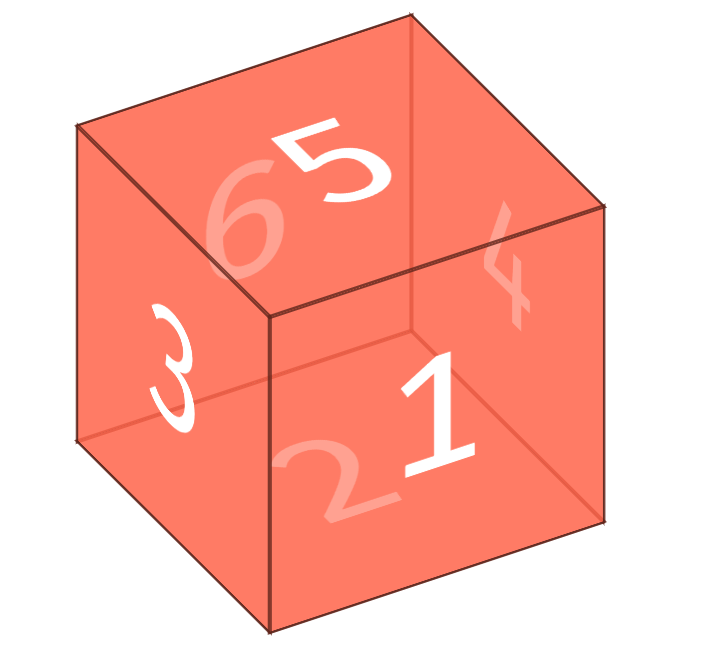

[toc]

## CSS 画正方体codepen

```CSS
.cube {
  font-size: 4em;
  /* 相对于父元素的大小，父元素是16px，这里是64px */
  width: 2em;
  /* 32px */
  margin: 1.5em auto;
  transform-style: preserve-3d;
  transform: rotateX(-35deg) rotateY(30deg);
}

.side {
  position: absolute;
  width: 2em;
  /* 相对于父元素的64px的大小，也就是128px */
  height: 2em;
  background: rgba(255, 99, 71, 0.6);
  border: 1px solid rgba(0, 0, 0, 0.5);
  color: white;
  text-align: center;
  line-height: 2em;
}

.front {
  transform: translateZ(1em);
}

.bottom {
  transform: rotateX(90deg) translateZ(-1em);
}

.top {
  transform: rotateX(90deg) translateZ(1em);
}


.left {
  transform: rotateY(-90deg) translateZ(1em);
}

.right {
  transform: rotateY(-90deg) translateZ(-1em);
}

.back {
  transform: translateZ(-1em);
}
```

```HTML
<div class="cube">
  <div class="side front">1</div>
  <div class="side back">6</div>
  <div class="side right">4</div>
  <div class="side left">3</div>
  <div class="side top">5</div>
  <div class="side bottom">2</div>
</div>
```

效果图：


## CSS 实现一个硬币旋转的效果

> [参考网站](https://wow.techbrood.com/fiddle/1510)

```CSS
 #euro {
    width: 150px;
    height: 150px;
    margin-left: -75px;
    margin-top: -75px;
    position: absolute;
    top: 50%;
    left: 50%;
    transform-style: preserve-3d;
    animation: spin 2.5s linear infinite;
  }
  .back {
    background-image: url("/uploads/160101/backeuro.png");
    width: 150px;
    height: 150px;
  }
  .middle {
    background-image: url("/uploads/160101/faceeuro.png");
    width: 150px;
    height: 150px;
    transform: translateZ(1px);
    position: absolute;
    top: 0;
  }
  .front {
    background-image: url("/uploads/160101/faceeuro.png");
    height: 150px;
    position: absolute;
    top: 0;
    transform: translateZ(10px);
    width: 150px;
  }
  @keyframes spin {
    0% {
      transform: rotateY(0deg);
    }
    100% {
      transform: rotateY(360deg);
    }
  }
```

## 移动端适配的方法

> 起因:手机设备屏幕尺寸不一，做移动端的Web页面，需要考虑安卓/IOS的各种尺寸设备上的兼容，针对移动端设备的页面，设计与前端实现怎样做能更好地适配不同屏幕宽度的移动设备；

1. flex 弹性布局
2. viewport 适配

    ```html
    <meta name="viewport" content="width=750,initial-scale=0.5">
    ```

    initial-scale = 屏幕的宽度 / 设计稿的宽度

3. rem 弹性布局
4. rem + viewport 缩放

> 这也是淘宝使用的方案，根据屏幕宽度设定 rem 值，需要适配的元素都使用 rem 为单位，不需要适配的元素还是使用 px 为单位。（1em = 16px）

## 移动端 300ms 延迟的原因以及解决方案

[移动端 300ms 点击延迟和点击穿透](https://juejin.im/post/5b3cc9836fb9a04f9a5cb0e0)

> 移动端点击有 300ms 的延迟是因为移动端会有双击缩放的这个操作，因此浏览器在 click 之后要等待 300ms，看用户有没有下一次点击，来判断这次操作是不是双击。

有三种办法来解决这个问题：

1. 通过 meta 标签禁用网页的缩放。

    ```html
    <meta name="viewport" content="user-scalable=no">
    ```

2. 更改默认的视口宽度

    ```html
    <meta name="viewport" content="width=device-width">
    ```

3. 调用一些 js 库，比如 FastClick

    > FastClick 是 FT Labs 专门为解决移动端浏览器 300 毫秒点击延迟问题所开发的一个轻量级的库。FastClick 的实现原理是在检测到 touchend 事件的时候，会通过 DOM 自定义事件立即出发模拟一个 click 事件，并把浏览器在 300ms 之后的 click 事件阻止掉。