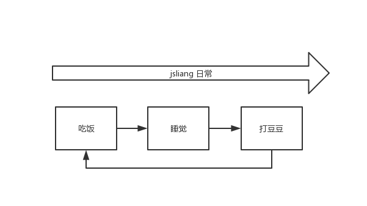
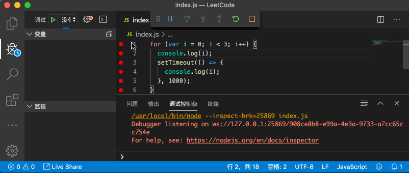
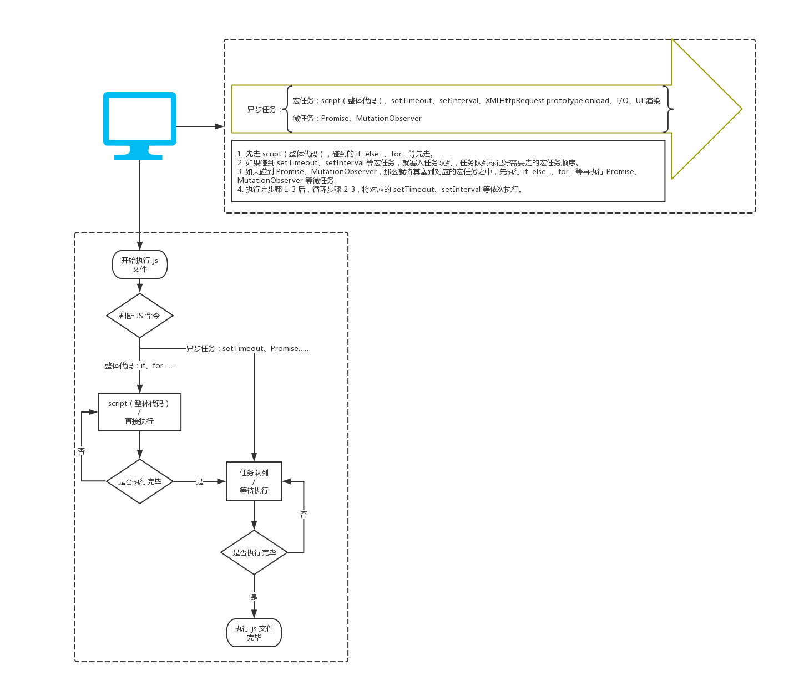
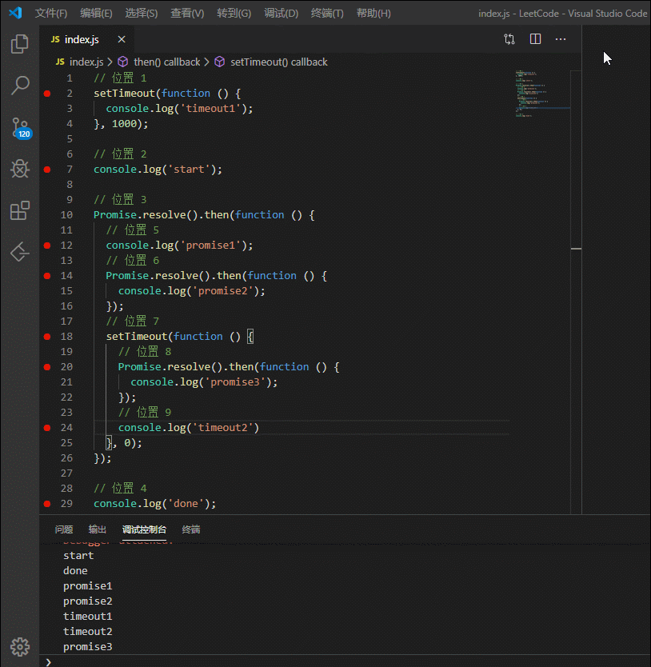
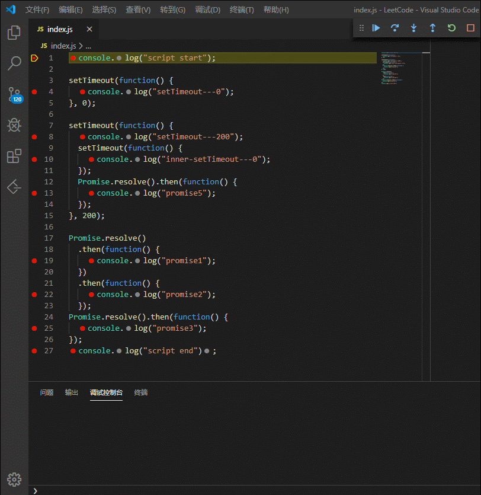

Event Loop
===

> Create by **jsliang** on **2019-12-09 11:34:15**  
> Recently revised in **2019-12-15 21:12:21**

**欢迎关注 jsliang 的文档库 —— 一个穷尽一生更新的仓库，查看更多技术、理财、健身文章：https://github.com/LiangJunrong/document-library**

## 一 目录

**不折腾的前端，和咸鱼有什么区别**

| 目录 |
| --- | 
| [一 目录](#chapter-one) | 
| [二 前言](#chapter-two) |
| [三 Event Loop](#chapter-three) |
| [四 浏览器 Event Loop](#chapter-four) |
| &emsp;[4.1 示例 1](#chapter-four-one) |
| &emsp;[4.2 示例 2](#chapter-four-two) |
| &emsp;[4.3 示例 3](#chapter-four-three) |
| &emsp;[4.4 小结](#chapter-four-four) |
| [五 Node.js Event Loop](#chapter-five) |
| &emsp;[5.1 setTimeout & setImmediate](#chapter-five-one) |
| &emsp;[5.2 process.nextTick()](#chapter-five-two) |
| &emsp;[5.3 示例 1](#chapter-five-three) |
| &emsp;[5.4 示例 2](#chapter-five-four) |
| &emsp;[5.5 小结](#chapter-five-five) |
| [六 总结](#chapter-six) |
| [七 参考文献](#chapter-seven) |

## 二 前言


Hello 小伙伴们早上好、中午好、下午好、晚上好、凌晨好~

在日常工作中，你有没有碰到过这种疑惑：

* 疑惑一：为什么这份代码它不按照我的意思走？为啥不是输出 `1 2 3`？

```js
for (var i = 0; i < 3; i++) {
  setTimeout(() => {
    console.log(i);
  }, 1000);
}
// console:
// 3
// 3
// 3
```

* 疑惑二：为什么这份代码它也不按照我的意思走？为啥不是输出 `jsliang`？

```js
let name;

setTimeout(() => {
  name = '梁峻荣';
  console.log(name);
}, 1000);

if (name) {
  name = 'jsliang';
  console.log(name);
}
// console: '梁峻荣'
```

孩子没娘，说来话长。

既然说来话长，**jsliang** 只能尝试长话短说了：

* **本篇文章从 Event Loop 起因说起，通过探讨 浏览器环境 Event Loop 和 Node.js 环境 Event Loop，从而解惑工作中产生的困扰，扩展你面试知识点。**

这么一说，咱也好对文章进行划分了：

* **第三章 Event Loop**：解释 Event Loop 产生原因和代码演示。
* **第四章 浏览器 Event Loop**：解惑工作困扰和扩展必备面试知识点。
* **第五章 Node.js Event Loop**：进一步探索浏览器和 Node.js 中 Event Loop 的不同。

OK，Let's go!

## 三 Event Loop


* 问：什么是 Event Loop，为什么需要 Event Loop？

答：

**首先**，我们需要知道的是：JavaScript 是单线程的。

单线程意味着，所有任务都需要排队，前一个任务结束，才会执行后一个任务。

假设 **jsliang** 和 JavaScript 一样一次只能做一件事，那么大概就是如下图所示。



而这种 **主线程从 “任务队列” 中读取执行事件，不断循环重复的过程**，就被称为 **事件循环（Event Loop）**。

**然后**，如果前一个任务耗时很长，后一个任务就不得不一直等着，那么我们肯定要对这种情况做一些特殊处理，毕竟很多时候我们并不是完全希望它如此执行。

所以为了协调事件（event），用户交互（user interaction），脚本（script），渲染（rendering），网络（networking）等，用户代理（user agent）必须使用事件循环（event loops）。

这样，在了解 **浏览器 Event Loop** 和 **Node.js Event Loop** 的情况下，我们就可以了解它的执行过程。

通过自身的了解，来处理一些较为棘手的问题。

为了加深小伙伴们的印象，可以看下图：


**jsliang** 日常中，强制被加上了 “被豆豆妈打”（废话，豆豆那么可爱，你怎么可以打豆豆）。

当然，这个被打的顺序也不一定是在后面，可能打多两次后，“睡觉” 完之后就是 “被豆豆妈打” 了。

通过这个解释，小伙伴们应该知道为啥有 **浏览器 Event Loop** 和 **Node.js Event Loop** 了。

等等，你刚才说到了 **浏览器 Event Loop** 和 **Node.js Event Loop**，为什么都是关于 JavaScript 的，在这两部分都不一样呢？

* 简单来说：**你的页面放到了浏览器去展示，你的数据放到了后台处理（将 Node.js 看成 PHP、Java 等后端语言），这两者能没有区别么？！**

你说了跟没说一样，为什么会这样你没有解释啊！

好的，说得再仔细点：

* **Node.js**：Node.js 的 Event Loop 是基于 libuv。libuv 已经对 Event Loop 作出了实现。
* **浏览器**：浏览器的 Event Loop 是基于 [HTML5 规范](https://html.spec.whatwg.org/multipage/webappapis.html#event-loops)的。而 HTML5 规范中只是定义了浏览器中的 Event Loop 的模型，具体实现留给了浏览器厂商。

> libuv 是一个多平台支持库，主要用于异步 I/O。它最初是为 Node.js 开发的，现在 Luvit、Julia、pyuv 和其他的框架也使用它。[Github - libuv 仓库](https://github.com/libuv/libuv)

恍然大悟，的确是不一样的啊！

所以，咱们得将这两个 Event Loop 区分开来，它们是不一样的东东哈~

**最后**，咱们解疑开头的两个问题，为什么会这样子，有没办法解决？

* 疑惑一：为什么这份代码它不按照我的意思走？为啥不是输出 `1 2 3`？

```js
for (var i = 0; i < 3; i++) {
  setTimeout(() => {
    console.log(i);
  }, 1000);
}
// console:
// 3
// 3
// 3
```

这道题是面试常备题，它是个很有意思的问题，不仅可以让面试官跟你闲聊到 Event Loop，也可以闲聊下 `var let const`。

为此，**jsliang** 特意录制了一个 GIF，希望能帮助小伙伴进一步探索这个机制：



> 软件是 VS Code，调试方式是 Node.js

请仔细观看 GIF 图：

1. 在执行 `for` 遍历的时候，它先执行了和 `setTimeout` 同级的 `console`，然后往下执行，到 `setTimeout` 的时候，跳过了（放到某个位置）`setTimeout`，依次打印了 `0, 1, 2`。
2. 步骤 1 跳过的三次 `setTimeout` 开始执行，但是这时候的 `i` 的值，经过前面的 `i++` 后，变成了 `3`（`for` 中止循环后，`i` 已经是 `3` 了）。所以，再依次打印了 `3 3 3`。

就是说，先走了正常的 `for`，然后碰到 `setTimeout` 时，将 `setTimeout` 依次放到了异次元，最后走完 `for` 后，再将异次元中的的 `setTimeout` 放出，依次将数字给输出了。

这个执行机制，就是 Event Loop 的影响，恍然大悟有木有~

这个问题的精妙之处在于，它不仅可以问你关于 Event Loop 的部分，还可以考察你对于 ES6 的 `let` 和 ES5 的 `var` 的区分，因为它有一个解决方式就是使用了 ES6 的 `let`。

> 解决这个问题之前，不妨思考下下面的输出：

```js
for (var i = 0; i < 3; i++) {

}
for (let j = 0; j < 3; j++) {

}
console.log(i);
console.log(j);
```

如果小伙伴对 ES6 有些许了解，应该不难猜出：

```
3
ReferenceError: j is not defined
```

是不是有些想法，那么咱们再看下下面的解决方法，再进行总结：

```js
for (let i = 0; i < 3; i++) {
  setTimeout(() => {
    console.log(i);
  }, 1000);
}
// console：
// 0
// 1
// 2
```

是的，将 `var i` 改成了 `let i` 后，输出的结果依次是 `0 1 2` 了。

为什么呢？简单回复就是：

**`let` 在 `for` 中形成了独特的作用域块，当前的 `i` 只在本轮循环中有效，然后 `setTimeout` 会找到本轮最接近的 `i`，从而作出了正确的输出。**

而我们通过 `var` 进行的定义，它会污染全局变量，所以在 `for` 外层，还可以看到 `i` 的值。

当然，讲到这里，你可能还是不太清楚更细节的区分，亦或者面试官进一步问你 `var let const` 的区分了，你要怎么更好回答？

看看阮一峰大佬的 ES6 文档吧：http://es6.ruanyifeng.com/#docs/let

这里就不哆嗦了，有空我再将 ES6 这块内容整理到我的文档库中，欢迎持续关注 jsliang 的文档库：https://github.com/LiangJunrong/document-library。

* 疑惑二：为什么这份代码它也不按照我的意思走？为啥不是输出 `梁峻荣`？

```js
let name;

setTimeout(() => {
  name = 'jsliang';
  console.log(name);
}, 1000);

if (name) {
  name = '梁峻荣';
  console.log(name);
}
// console: 'jsliang'
```

当你了解产生疑惑一的原因后，疑惑二也就不破而解了。

我们希望的是 JavaScript 按照我们需要的顺序写，结果它并没有，就是因为受到了 Event Loop 的影响。

JavaScript 在碰到 `setTimeout` 的时候，会将它封印进异次元，只有等所有正常的语句（`if`、`for`……）执行完毕后，才会将它从异次元解封，输出最终结果。

咦，这就有意思了，浏览器的异次元和 Node.js 的异次元都是怎样的呢？我们一起往下看。

## 四 浏览器 Event Loop


在讲解浏览器的 Event Loop 前，我们需要先了解一下 JavaScript 的运行机制：

1. 所有同步任务都在主线程上执行，形成一个 **“执行栈”**（execution context stack）。
2. 主线程之外，存在一个 **“任务队列”**（task queue），在走主流程的时候，如果碰到异步任务，那么就在 **“任务队列”** 中放置这个异步任务。
3. 一旦 **“执行栈”** 中所有同步任务执行完毕，系统就会读取 **“任务队列”**，看看里面存在哪些事件。那些对应的异步任务，结束等待状态，进入执行栈，开始执行。
4. 主线程不断重复上面三个步骤。

而 JavaScript 的异步任务，还细分两种任务：

* **宏任务（Macrotask）**：`script`（整体代码）、`setTimeout`、`setInterval`、`XMLHttpRequest.prototype.onload`、`I/O`、UI 渲染
* **微任务（Microtask）**：`Promise`、`MutationObserver`

这么讲是不太容易理解的，咱们上图：



> 图较大，如果是公众号看的小伙伴，可以点击【阅读原文】看全图

好的，如果小伙伴们看不清楚，那么咱们还是通过代码来进行讲解，毕竟以上属于 **jsliang** 个人理解，是从 15 篇以上文章和自己观察代码运行总结出来的。

### 4.1 示例 1


那么，上代码~

> 示例 1

```js
// 位置 1
setTimeout(function () {
  console.log('timeout1');
}, 1000);

// 位置 2
console.log('start');

// 位置 3
Promise.resolve().then(function () {
  // 位置 5
  console.log('promise1');
  // 位置 6
  Promise.resolve().then(function () {
    console.log('promise2');
  });
  // 位置 7
  setTimeout(function () {
    // 位置 8
    Promise.resolve().then(function () {
      console.log('promise3');
    });
    // 位置 9
    console.log('timeout2')
  }, 0);
});

// 位置 4
console.log('done');
```

**提问**：请指出上面代码的输出结果？

**回答**：

这是经典的面试题型，所以咱们看到不用慌，先拿我们上面的点，区分下分宏任务和微任务：

* **宏任务（Macrotask）**：`script`（整体代码）、`setTimeout`、`setInterval`、`XMLHttpRequest.prototype.onload`、`I/O`、UI 渲染
* **微任务（Microtask）**：`Promise`、`MutationObserver`

OK，开始走流程：

> **如果你觉得文字不好理解，请往下翻，有 GIF 图演示！！！**

1. 首先碰到的是 `script`（整体代码），先看【位置 1】，属于宏任务 `setTimeout` 下的，所以做个标记，待会回来执行。
2. 接着碰到【位置 2】，这是 `script`（整体代码）下的无阻碍代码，直接执行即可。
3. 再来碰到【位置 3】，它现在是 `script`（整体代码）下的微任务，所以咱们做个标记，走完文件所有代码后，优先执行微任务，再执行宏任务。
4. 最后碰到【位置 4】，它是 `script`（整体代码）下的无阻碍代码，直接执行即可。

这样，第一波步骤，我们输出的是【位置 2】的 `start` 和【位置 4】的 `done`。

我们接着走：

1. 上面我们走完了第一遍代码，然后现在这一步先走 `script`（整体代码）下的微任务，即【位置 3】
   1. 先碰到【位置 5】，这是无阻碍代码，直接执行。
   2. 再碰到【位置 6】，这是微任务，标记一下，等下执行完【位置 3】内所有代码后，优先执行它。
   3. 最后碰到【位置 7】，这是宏任务，丢入任务队列，看它和【位置 1】谁先走了。
2. 走完一遍【位置 3】后，发现还有微任务【位置 6】，所以执行【位置 6】，进行打印输出。

到这一步，我们就走完了 `script`（整体代码）及之下的所有微任务了。

这时候，我们会说，【位置 1】和【位置 7】都被丢到任务队列了，是不是【位置 1】先走呢？

答案为：不是的。

同样的 `setTimeout`，**jsliang** 在测试的时候，就发现它们的输出结果在各个环境都有自己的流程，有时候先走【位置 7】，再走【位置 1】；而有时候先走【位置 1】，再走【位置 7】。

当然，如果你指定是在 `Chrome` 的控制台输出一下上面的代码，那就是先【位置 7】，再【位置 1】~

* **point：不要主观臆断某个代码会怎么走，最好还是直接实况运行走一波！**

1. 先走【位置 7】。碰到【位置 8】，将其添加到【位置 7】的微任务中，等【位置 7】所有代码执行完毕回来优先走微任务；碰到【位置 9】，这是无阻碍代码，直接输出即可。
2. 执行【位置 7】的微任务【位置 8】，输出对应文本。
3. 最后走【位置 1】，输出对应文本。

所以答案是：

```
start
done
promise1
promise2
timeout2
promise3
timeout1
```

你猜对没有？

没有可以看下 GIF 图加深印象：



### 4.2 示例 2


在上面，**jsliang** 花费了许多口水，讲了一些繁杂冗余的步骤，所以下面这个示例，请小伙伴们先自行猜设，得出结论后再翻看答案和调试 GIF~

> 示例 2

```js
console.log("script start");

setTimeout(function() {
  console.log("setTimeout---0");
}, 0);

setTimeout(function() {
  console.log("setTimeout---200");
  setTimeout(function() {
    console.log("inner-setTimeout---0");
  });
  Promise.resolve().then(function() {
    console.log("promise5");
  });
}, 200);

Promise.resolve()
  .then(function() {
    console.log("promise1");
  })
  .then(function() {
    console.log("promise2");
  });
Promise.resolve().then(function() {
  console.log("promise3");
});
console.log("script end");
```

---
---
---

* **输出结果**：

```
script start
script end
promise1
promise3
promise2
setTimeout---0
setTimeout---200
promise5
inner-setTimeout---0
```

* **GIF 演示**：



### 4.3 示例 3


最后再看一个示例：

> 示例 3

```js
setTimeout(function() {
  console.log(4);
}, 0);

const promise = new Promise(function executor(resolve) {
  console.log(1);
  for (var i = 0; i < 10000; i++) {
    i == 9999 && resolve();
  }
  console.log(2);
}).then(function() {
  console.log(5);
});

console.log(3);
```

---
---
---

* **输出结果**：

```
1
2
3
5
4
```

如果不常用 `Promise` 的小伙伴，可能对此感到疑惑，为啥不是：`3 1 2 5 4`？

手动滑稽，别问，问就是进一步探索 `Promise`：

* 《jsliang 的 Promise 探索》：https://github.com/LiangJunrong/document-library/blob/master/JavaScript-library/JavaScript/%E5%85%B6%E4%BB%96/Promise.md

当然，还没将所有探索结果更新，如果有小伙伴催更会加快速度，欢迎留言或者私聊催更，哈哈~

### 4.4 小结


这样，我们就通过 3 个示例，大致了解了浏览器的 Event Loop。

当然，实际应用中的代码，何止这么简单，甚至有时候，面试官给你的面试题，也会让你瞠目结舌。

所以，这里咱们废话两点：

1. 你可以了解宏任务和微任务的大体执行，例如先走 `if...else...`，再走 `Promise`……但是，详细到每个 `point` 都记下来，这里不推荐。大人，时代在进步，记住死的不如多在业务实践中尝试，取最新的知识。
2. 浏览器的 Event Loop 和 Node.js 的 Event Loop 不同，万一哪天 XX 小程序搞另类，有自己的 Event Loop，你要一一记住吗？

碰到问题不要慌，程序员，折腾就对了~

## 五 Node.js Event Loop


那么，下面咱们吐槽下 Node.js 的 Event Loop。

> 说实话，看完 Node 官网和大佬们关于 Node.js 的 Event Loop 讲解，让我想起了 Vue、React、微信小程序 的【生命周期】，再联想到我们的人生仿佛就像被写死的程序一样周期性、事件性运行，非常可恶，哈哈~

上面我们讲解过：Node.js 的 Event Loop 是基于 libuv。libuv 已经对 Event Loop 作出了实现。

那么其机制是怎样子的呢？看图：

```
   ┌───────────────────────────┐
┌─>│           timers          │
│  └─────────────┬─────────────┘
│  ┌─────────────┴─────────────┐
│  │     pending callbacks     │
│  └─────────────┬─────────────┘
│  ┌─────────────┴─────────────┐
│  │       idle, prepare       │
│  └─────────────┬─────────────┘      ┌───────────────┐
│  ┌─────────────┴─────────────┐      │   incoming:   │
│  │           poll            │<─────┤  connections, │
│  └─────────────┬─────────────┘      │   data, etc.  │
│  ┌─────────────┴─────────────┐      └───────────────┘
│  │           check           │
│  └─────────────┬─────────────┘
│  ┌─────────────┴─────────────┐
└──┤      close callbacks      │
   └───────────────────────────┘
```

关于这 6 个阶段，官网描述为：

* **定时器（timers）**：本阶段执行已经被 `setTimeout()` 和 `setInterval()` 的调度回调函数。
* **待定回调（pending callbacks）**：执行延迟到下一个循环迭代的 I/O 回调。
* **idle, prepare**：仅系统内部使用。
* **轮询（poll）**：检索新的 I/O 事件；执行与 I/O 相关的回调（几乎所有情况下，除了关闭的回调函数，那些由计时器和 `setImmediate()` 调度的之外），其余情况 `Node` 将在适当的时候在此阻塞。
* **检测（check）**：`setImmediate()` 回调函数在这里执行。
* **关闭的回调函数（close callbacks）**：一些关闭的回调函数，如：`socket.on('close', ...)`。

当然，这里 **jsliang** 并不想画蛇添足，将官网或者其他大佬的文章照搬过来说是自己的，推荐小伙伴们阅读官网关于 Event Loop 的各个阶段的描述，以期在工作中有所使用：

* 《Node 官方讲解 Event Loop》：https://nodejs.org/zh-cn/docs/guides/event-loop-timers-and-nexttick/

Node.js 在不停的探索中，也会有所更新，所以正应了 **jsliang** 在浏览器 Event Loop 中的小结所说：**不要限定死自己的知识点，与时俱进才是王道**。

> Node.js v9.5.0 Event Loop

```
   ┌───────────────────────┐
┌─>│        timers         │
│  └──────────┬────────────┘
│  ┌──────────┴────────────┐
│  │     I/O callbacks     │
│  └──────────┬────────────┘
│  ┌──────────┴────────────┐
│  │     idle, prepare     │
│  └──────────┬────────────┘      ┌───────────────┐
│  ┌──────────┴────────────┐      │   incoming:   │
│  │         poll          │<─────┤  connections, │
│  └──────────┬────────────┘      │   data, etc.  │
│  ┌──────────┴────────────┐      └───────────────┘
│  │        check          │
│  └──────────┬────────────┘
│  ┌──────────┴────────────┐
└──┤    close callbacks    │
   └───────────────────────┘
```

但是，迫于生活所需，有些时候，前端面试官还是会跟你扯 `setTimeout & setImmediate` 和 `process.nextTice()`。

### 5.1 setTimeout & setImmediate


* **setTimeout**：众所周知，这是一个定时器，指定 `n` 毫秒后执行定时器里面的内容。
* **setImmediate**：Node.js 发现使用 `setTimeout` 和 `setInterval` 有些小弊端，所以设计了个 `setImmediate`，该方法被设计为一旦在当前轮询阶段完成，就执行这个脚本。

当然，光说无益，看代码：

> index.js

```js
setTimeout(() => {
  console.log('timeout');
}, 0);

setImmediate(() => {
  console.log('immediate');
});
```

猜测下在 VS Code 中执行 `node index.js` 命令会发生什么？

> 结局 1

```
immediate
timeout
```

> 结局 2

```
timeout
immediate
```

事实上这两个结局都是会存在的，看似 **happy ending**，但是有的小伙伴可能心里闹翻天。

按照官网的解释：

* 执行计时器的顺序将根据调用它们的上下文而异。
* 如果两则都从主模块内调用，则计时器将受到进程性能的约束（这可能会受到计算机上其他正在运行应用程序的影响）。
* 如果你将这两个函数放入一个 I/O 循环内调用，`setImmediate` 总是被有限调用。

```js
const fs = require('fs');

fs.readFile(__filename, () => {
  setTimeout(() => {
    console.log('timeout');
  }, 0);
  setImmediate(() => {
    console.log('immediate');
  });
});
```

虽然官方解释的很 **巧妙**，但是不管你懂不懂，反正我觉得有点扯淡。

最后再来句官方总结：

* 使用 `setImmediate()` 相对于 `setTimeout` 的主要优势是：如果 `setImmediate()` 是在 I/O 周期内被调度的，那么它将会在任何的定时器之前执行，跟这里存在多少个定时器无关。

enm...后面如果我具体使用 Node.js 的时候，我再进一步观察吧，至于现在，我还是先了解下即可。

### 5.2 process.nextTick()


`nextTick` 比较特殊，它存有自己的队列。

并且，它独立于 Event Loop，无论 Event Loop 处于何种阶段，都会在阶段结束的时候清空 `nextTick` 队列。

还有需要注意的是：`process.nextTick()` 优先于其他的微任务（microtask）执行。

当然，如果你对此有所兴趣，你可以进一步探索源码，或者观察大佬们探索源码：

* [《不要混淆 nodejs 和浏览器中的 event loop》](https://cnodejs.org/topic/5a9108d78d6e16e56bb80882)
* [《浏览器与 Node 的事件循环（Event Loop）有何区别?》](https://juejin.im/post/5c337ae06fb9a049bc4cd218)

没有使用就没有发言权，作为一个 Node.js 菜鸡，这里就不妄加评论分析了。

### 5.3 示例 1


下面开始示例，我们看下 Node.js 的 Event Loop 有何差异：

> 示例 1

```js
setTimeout(() => {
  console.log("timer1");
  Promise.resolve().then(function() {
    console.log("promise1");
  });
});

setTimeout(() => {
  console.log("timer2");
  Promise.resolve().then(function() {
    console.log("promise2");
  });
});
```

如果你还记得上面讲解的浏览器的 Event Loop，你可能会将答案直接写成：

> 浏览器 Event Loop 输出：

```
timer1
promise1
timer2
promise2
```

是的你是对的，那就是浏览器的 Event Loop，到了 Node.js 这块，就有不同变化了：

> Node.js Event Loop 输出：

```
timer1
timer2
promise1
promise2
```

尝试接受它！

然后大声默念：**根据具体环境进行对应观察和得出结论**。

### 5.4 示例 2


下面咱们再看一个示例：

> 示例 2

```js
setTimeout(function () {
   console.log(1);
});
console.log(2);
process.nextTick(() => {
   console.log(3);
});
new Promise(function (resolve, rejected) {
   console.log(4);
   resolve()
}).then(res=>{
   console.log(5);
})
setImmediate(function () {
   console.log(6)
})
console.log('end');
```

> node index.js

```
2
4
end
3
5
1
6
```

这里不打算解析，因为我怕初识 Event Loop 的小伙伴看完解释后懵逼，然后搞混淆了。

> 实话：我也不敢解析，因为我就是 Node.js 菜鸡

### 5.5 小结


终上所述，我们进行小结：

Node 端事件循环中的异步队列也是这两种：Macrotask（宏任务）队列和 Microtask（微任务）队列。

* 常见的 Macrotask：`setTimeout`、`setInterval`、`setImmediate`、`script`（整体代码）、 I/O 操作等。
* 常见的 Microtask：`process.nextTick`、`new Promise().then(回调)` 等。

OK，咱们就探索了一遍 Node.js 的 Event Loop 啦，但是因为咱还成就不了 **Node.js 工程师**，所以咱就不对其进行详细探索，以免和浏览器的 Event Loop 混淆了。

感兴趣的小伙伴可以自行探索咯~

## 六 总结


如果你看到这里，你已经近乎懵逼，那么，还是那个建议：

* **不管 Event Loop 在浏览器亦或者 Node.js 表现机制，最好的操作还是在对应环境中进行尝试。**

你不能完全保证你的记忆力是 OK 的，所以你只需要知道有这个问题，然后在工作中实践解决即可。

enm...所以你看完了一篇水文，唯一的作用是让你面试的时候，能愉快地玩耍一些简单题目~

哈哈，Good luck.

> 如果你觉得我的文章还不错，想持续关注或者加我微信好友，欢迎前往 https://github.com/LiangJunrong/document-library 进行 star 或者加微信。

## 七 参考文献


感谢以下大佬们的文章，让我受益颇多。

并在他们创作的基础上，基于自己的想法，进行了整合。

1. [《Tasks, microtasks, queues and schedules》 - Jake](https://jakearchibald.com/2015/tasks-microtasks-queues-and-schedules/)
2. [《彻底搞懂浏览器 Event-loop》 - 刘小夕](https://juejin.im/post/5c947bca5188257de704121d)
3. [《彻底理解 JS Event Loop（浏览器环境）》 - 93](https://juejin.im/post/5aa3332b518825557c011896)
4. [《彻底弄懂浏览器端的 Event-Loop》 - 长可](https://juejin.im/post/5c303e67518825260b46cbdc)
5. [《什么是浏览器的事件循环（Event Loop）？》 - 鱼子酱](https://segmentfault.com/a/1190000010622146)
6. [《理解event loop（浏览器环境与nodejs环境）》 - sugerpocket](https://imweb.io/topic/5b148768d4c96b9b1b4c4ea1)
7. [《从 event loop 规范探究 JavaScript 异步及浏览器更新渲染时机》 - 杨敬卓](https://github.com/aooy/blog/issues/5)
8. [《跟着 Event loop 规范理解浏览器中的异步机制》 - fi3ework](https://github.com/fi3ework/blog/issues/29)
9. [《不要混淆 nodejs 和浏览器中的 event loop》 - youth7](https://cnodejs.org/topic/5a9108d78d6e16e56bb80882)
10. [《浏览器的 event loop 和 node 的 event loop》 - 金大光](https://juejin.im/post/5b095a1d6fb9a07abc2a5e81)
11. [《浏览器与 Node 的事件循环(Event Loop)有何区别?》 - 浪里行舟](https://juejin.im/post/5c337ae06fb9a049bc4cd218)
12. [《浏览器和 Node 不同的事件循环（Event Loop）》 - toBeTheLight](https://juejin.im/post/5aa5dcabf265da239c7afe1e)
13. [《let 和 const 命令》 - 阮一峰](http://es6.ruanyifeng.com/#docs/let)
14. [《Node.js Event Loop》 - Node.js 官网](https://nodejs.org/zh-cn/docs/guides/event-loop-timers-and-nexttick/)

---

**不折腾的前端，和咸鱼有什么区别！**


**jsliang** 会每天更新一道 LeetCode 题解，从而帮助小伙伴们夯实原生 JS 基础，了解与学习算法与数据结构。

**浪子神剑** 会每天更新面试题，以面试题为驱动来带动大家学习，坚持每天学习与思考，每天进步一点！

扫描上方二维码，关注 **jsliang** 的公众号（左）和 **浪子神剑** 的公众号（右），让我们一起折腾！

