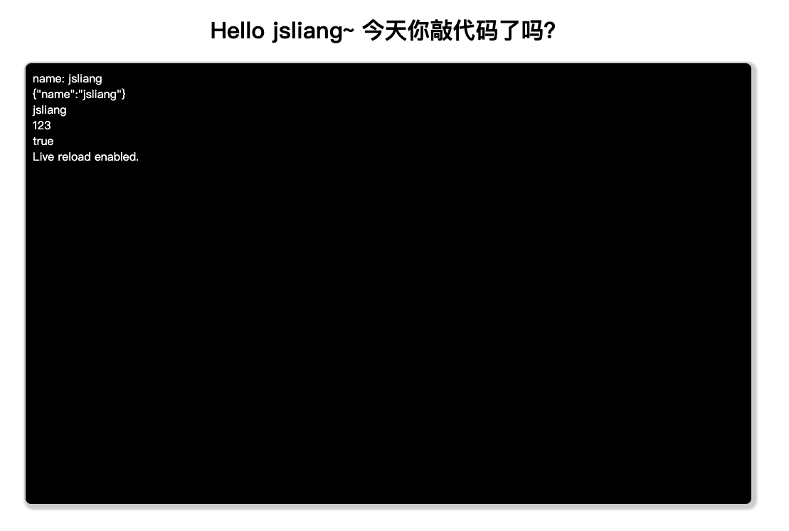

console 那些事
===

> create by **jsliang** on **2020-4-10 08:47:24**  
> Recently revised in **2020-04-10 19:57:33**

## <a name="chapter-one" id="chapter-one">一 目录</a>

**不折腾的前端，和咸鱼有什么区别**

| 目录 |
| --- | 
| [一 目录](#chapter-one) | 
| [二 前言](#chapter-two) |
| [三 实现代码](#chapter-three) |
| [四 console.log](#chapter-four) |
| [五 console.time](#chapter-five) |
| [六 window.performance.now](#chapter-six) |
| [七 总结](#chapter-seven) |
| [八 参考文献](#chapter-eight) |

## <a name="chapter-two" id="chapter-two">二 前言</a>


今天突发奇想，能不能将 Console 的文字打印到 HTML 中呢？

答案是可以的：


那么，在探索实现的过程中，**jsliang** 做了什么事，咱们一一瞅瞅~

## <a name="chapter-three" id="chapter-three">三 实现代码</a>


先将源码抛出来，方便白嫖的小伙伴可以拿了就跑：

> index.html

```html
<!DOCTYPE html>
<html lang="en">
<head>
  <meta charset="UTF-8">
  <meta name="viewport" content="width=device-width, initial-scale=1.0">
  <meta http-equiv="X-UA-Compatible" content="ie=edge">
  <title>JavaScript - 算法与数据结构</title>
  <style>
    .text-center {
      text-align: center;
    }
    .log {
      width: 1000px;
      height: 600px;
      overflow: auto;
      margin: 0 auto;
      padding: 10px;
      border: 2px solid #ccc;
      border-radius: 10px;
      box-shadow: 3px 3px 3px 3px #ccc;
      background: black;
      color: #fff;
    }
  </style>
</head>
<body>
  <div class="container">
    <h1 class="text-center">
      Hello jsliang~ 今天你敲代码了吗？
    </h1>
    <div class="log" id="log">

    </div>
  </div>
  <script>
    (function() {
      let logger = document.getElementById('log');
      console.log = function(message) {
        if (Object.prototype.toString.call(message).slice(8, -1) === 'Object') {
          logger.innerHTML += JSON.stringify(message) + '<br />';
        } else {
          logger.innerHTML += message + '<br />';
        }
      };
    })();
  </script>
  <script src="./index.js"></script>
</body>
</html>
```

> index.js

```js
console.log('name: jsliang');
console.log({name: 'jsliang'});
console.log(['jsliang']);
console.log(123);
console.log(true);

const start = window.performance.now();
for (let i = 0; i < 10000; i++) {
  // ...
}
const end = window.performance.now();
const time = end - start;
console.log(`运行时间：${time}`);
```

## <a name="chapter-four" id="chapter-four">四 console.log</a>


我们需要打印东西，第一时间想到的是什么呢？

没错，就是 `console.log()`，不知道小伙伴有没有同感：

* debugger 有时候步骤比较麻烦，还是直接 `console.log()` 打印看看数据比较省事。

当然，也有 Redux DevTools 等工具，但是说到最原始的还是 `console.log()`。

然后 **jsliang** 又不想打开 Chrome 的【审查元素】，于是我们就想个法子，将【审查元素】的 `Console` 内容打印到页面上呗：

> 实现代码

```js
(function() {
  let logger = document.getElementById('log');
  console.log = function(message) {
    if (Object.prototype.toString.call(message).slice(8, -1) === 'Object') {
      logger.innerHTML += JSON.stringify(message) + '<br />';
    } else {
      logger.innerHTML += message + '<br />';
    }
  };
})();
```

可以看到是重写了 `console.log` 的内容，就是说后面的 `console.log` 会调用这个方法。



## <a name="chapter-five" id="chapter-five">五 console.time</a>


那么这时候问题就来了，如果我们需要测试一些代码运行的时间，我们会怎么做？

```js
console.time('测试时间');
for (let i = 0; i < 10000; i++) {
  // ...
}
console.timeEnd('测试时间');
```

通过 `node index.js` 可以看到：

* `测试时间: 0.275ms`

当然，我们并不仅仅是需要在控制台查看，而是在网页中看到，那么应该怎么展示运行时间呢？

## <a name="chapter-six" id="chapter-six">六 window.performance.now</a>


```js
console.log('name: jsliang');
console.log({name: 'jsliang'});
console.log(['jsliang']);
console.log(123);
console.log(true);

const start = window.performance.now();
for (let i = 0; i < 10000; i++) {
  // ...
}
const end = window.performance.now();
const time = end - start;
console.log(`运行时间：${time}`);
```

此时通过 `live-server` 我们可以看到，它已经在控制台展示了！

## <a name="chapter-seven" id="chapter-seven">七 总结</a>


总结：

1. 查看打印：`console.log()`
2. 查看打印时间：`console.time()` & `console.timeEnd()`
3. 查看运行时间：`window.performance.now()`

这样，我们就简单溜达了下 `console.log()`。

## <a name="chapter-eight" id="chapter-eight">八 参考文献</a>


以下为参考的 30 来篇文献中起到作用的几篇文献：

* [【博客园】睡着的糖葫芦《Javascript 将 console.log 日志打印到 html 页面中》](https://www.cnblogs.com/loveyouyou616/p/11176647.html)
* [【IT屋】IT屋《如何从JS Console中的console.timeEnd（）获取输出？(How to get the output from console.timeEnd() in JS Console?)》](https://www.it1352.com/1057474.html)
* [【知乎】早乙女瑞穂《node.js 用 console.time 测试性能时的坑》](https://zhuanlan.zhihu.com/p/28978126)
* [【CodePen】Stripy rainbow text effects《彩虹字实现》](https://codepen.io/comehope/pen/ELpRxj?__cf_chl_jschl_tk__=53f1ed0e3427de9df3527acb17063421573fb546-1586478286-0-AZ7GbsdaToOebfm7UK657ujS3VMx00EYVWES3TL41Icoxc2P9kUu-38j_GVz9GrHpSp6y9DbcNBaxZbIcAGj-anqNrbrMAidYgTw5bYL6ME9w-zaWI8moVfUIsf_cpz-RrEEVQXk44wD4MD6pHctrJpgtqPpE1YGv6PQirG_XWZ6qx-0-Y1Vrz5vX-Te-FPbXxJxf0Aji2TrsB7DuwjgwtMPjVR9XrHDFinnxZInbnkMuwB0EFXBk5loAy7UYZjEHedQU09MpvuDbSmxHQaIa4JL_PhfufPsQHiPJfyxokimQW4Ov0VVxWIWfnVf9dLpOHz46A_1NKAbhQQMzmBmvLFYCXPT-TEVCumHfVtb685d)

> <a rel="license" href="http://creativecommons.org/licenses/by-nc-sa/4.0/"></a><br /><span xmlns:dct="http://purl.org/dc/terms/" property="dct:title">jsliang的文档库</span> 由 <a xmlns:cc="http://creativecommons.org/ns#" href="https://github.com/LiangJunrong/document-library" property="cc:attributionName" rel="cc:attributionURL">梁峻荣</a> 采用 <a rel="license" href="http://creativecommons.org/licenses/by-nc-sa/4.0/">知识共享 署名-非商业性使用-相同方式共享 4.0 国际 许可协议</a>进行许可。<br />基于<a xmlns:dct="http://purl.org/dc/terms/" href="https://github.com/LiangJunrong/document-library" rel="dct:source">https://github.com/LiangJunrong/document-library</a>上的作品创作。<br />本许可协议授权之外的使用权限可以从 <a xmlns:cc="http://creativecommons.org/ns#" href="https://creativecommons.org/licenses/by-nc-sa/2.5/cn/" rel="cc:morePermissions">https://creativecommons.org/licenses/by-nc-sa/2.5/cn/</a> 处获得。
