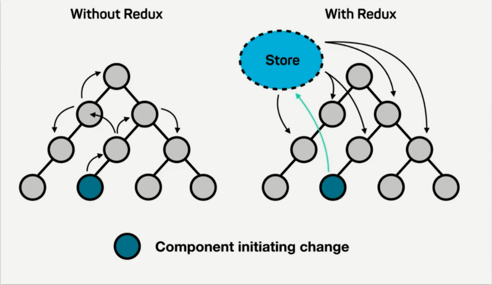

React List - React Redux
===

> Create by **jsliang** on **2019-3-26 08:51:55**  
> Recently revised in **2019-05-31 14:59:18**

**Hello 小伙伴们，如果觉得本文还不错，记得给个 **star** ， 小伙伴们的 **star** 是我持续更新的动力！[GitHub 地址](https://github.com/LiangJunrong/document-library)**

* [React 系列文章代码地址](https://github.com/LiangJunrong/React)

## <a name="chapter-one" id="chapter-one">一 目录</a>

**不折腾的前端，和咸鱼有什么区别**

| 目录 |
| --- | 
| [一 目录](#chapter-one) | 
| [二 前言](#chapter-two) |

## <a name="chapter-two" id="chapter-two">二 前言</a>

在 React 中，如果兄弟组件需要通讯，例如左侧中的深色圆圈发送到底部圆圈，需要兜很多弯子。

而 Redux 的出现，是为了弥补这种麻烦的通讯方式，建立起一个中央机制，方便各组件之间的通讯。

Redux = Reducer + Flux

如上图，即为 Redux 工作机制。

* 蓝色：借书人
* 黄色：借书动作
* 橙色：图书管理员
* 紫色：系统

它的流程可以理解为：借书人走到前台（借书动作）跟图书管理员申请借书，图书管理员帮它查找书籍资料，然后拿到电脑返回信息，告诉他去哪借就行了。

换回正常话，即：当组件（React Components）需要调用数据的时候，它就向创造器（Action Creators）发起请求，创造器通知管理者（Store），管理者就去查找相关资料（Reducers），拿到返回的信息后，再告诉组件。

### Redux 知识点补充

1. store 是唯一的
2. 只有 store 能够改变自己的内容

### Redux 核心 API

1. `createStore`：创建 store
2. `store.dispatch`：派发 action
3. `store.getState`：获取 store 所有数据内容
4. `store.subscribe`：监控 store 改变，store 改变了该方法就会被执行

### UI 组件和容器组件

* UI 组件 —— 傻瓜组件，做页面的渲染
* 容器组件 —— 聪明组件，做页面的逻辑

---

