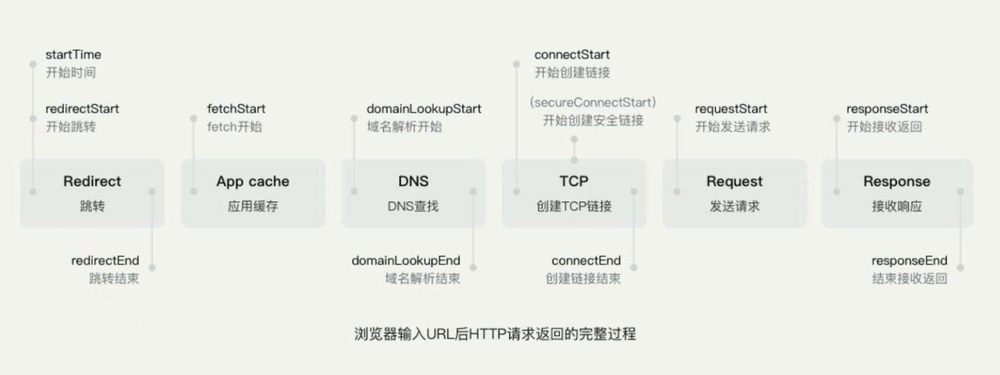
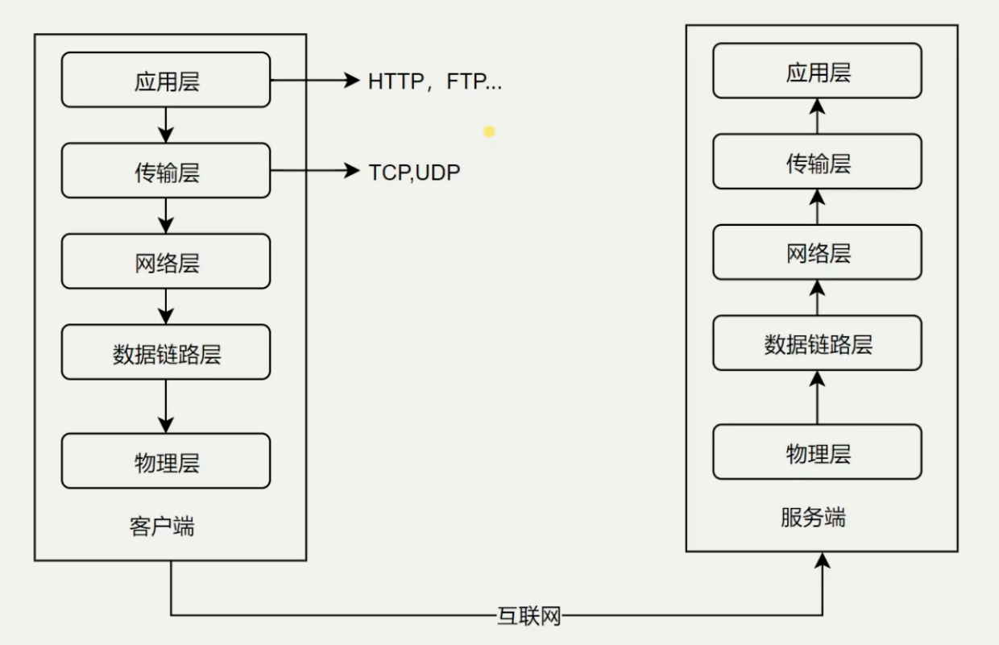

HTTP 学习
===

> Create by **jsliang** on **2018-12-24 08:18:27**  
> Recently revised in **2019-05-30 19:26:35**

## <a name="chapter-one" id="chapter-one">一 目录</a>

**不折腾的前端，和咸鱼有什么区别**

| 目录 |                                                                             
| --- | 
| [一 目录](#chapter-one) | 
| [二 前言](#chapter-two) |
| [三 正文](#chapter-three) |

## <a name="chapter-two" id="chapter-two">二 前言</a>

* **什么时候涉及 HTTP 协议？**

1. 输入 URL 打开网页
2. Ajax 获取数据
3. img 标签加载图片

* **什么是 HTTP 协议？**

1. HTTP 协议是 Hyper Text Transfer Protocol（超文本传输协议）的缩写，是用于从万维网（WWW：World Wide Web ）服务器传输超文本到本地浏览器的传送协议。
2. HTTP 协议是一个基于 TCP/IP 通信协议来传递数据（HTML 文件, 图片文件, 查询结果等）。
3. HTTP 是一个属于应用层的面向对象的协议，由于其简捷、快速的方式，适用于分布式超媒体信息系统。它于 1990 年提出，经过几年的使用与发展，得到不断地完善和扩展。目前在 WWW 中使用的是 HTTP/1.0 的第六版，HTTP/1.1 的规范化工作正在进行之中，而且 HTTP-NG(Next Generation of HTTP) 的建议已经提出。
4. HTTP 协议工作于客户端-服务端架构为上。浏览器作为 HTTP 客户端通过 URL 向 HTTP 服务端即 WEB 服务器发送所有请求。Web 服务器根据接收到的请求后，向客户端发送响应信息。

## <a name="chapter-three" id="chapter-three">三 正文</a>

浏览器输入 URL 后 HTTP 请求返回的完整过程

经典五层模型

* 物理层 - 主要作用是定义物理设备如何传输数据
* 数据链路层 - 在通信的实体间建立数据链路连接
* 网络层 - 为数据在节点之间出书创建逻辑链路
* 传输层 - 1. 向用户提供可靠的端到端（End-to-End）服务；2. 传输层向高层屏蔽了下层数据通信的细节
* 应用层 - 构建于 TCP 协议之上，为应用软件提供了很多服务

---

