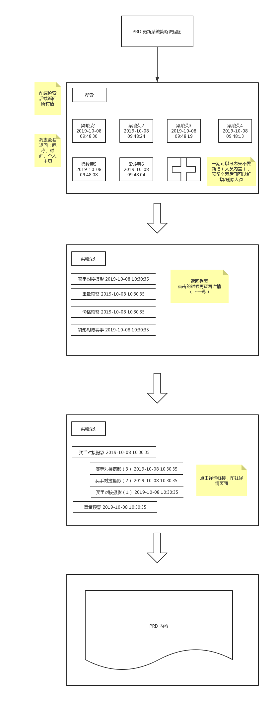

产品需求文档存取系统
===

> Create by **jsliang** on **2019-10-08 09:05:20**  
> Recently revised in **2019-10-09 19:13:21**

## <a name="chapter-one" id="chapter-one">一 目录</a>

**不折腾的前端，和咸鱼有什么区别**

| 目录 |
| --- | 
| [一 目录](#chapter-one) | 
| [二 前言](#chapter-two) |
| [三 需完成的功能](#chapter-three) |
| [四 需完成的界面](#chapter-four) |
| [五 数据库的设计](#chapter-five) |
| [六 接口文档设计](#chapter-six) |
| [七 前后端的分工](#chapter-seven) |
| [八 前后端的对接](#chapter-eight) |
| [九 项目线上部署](#chapter-night) |
| [十 总结](#chapter-ten) |

## <a name="chapter-two" id="chapter-two">二 前言</a>

一想着每次产品更新完 PRD（产品需求文档），然后整个团队（前端/后端/测试）都需要去指定页面下载一遍，再替换到本地最新文件夹中，看着那些文件夹 PRD（2019-10-01）、PRD（2019-10-02）、PRD（2019-10-02-2）……感觉就有些头大。

那么，有没有更好的方法，做一个文档更新系统，在线查阅 HTML、Word、Excel、PPT 等文件呢？

那么，我们需要实现这些功能大概需要哪些步骤呢？

* 需完成的功能
* 需完成的界面
* 数据库的设计
* 接口文档设计
* 前后端的分工
* 前后端的对接
* 项目线上部署

Now，我们从 0 到 1，从产品、UI、前端、后端、数据库、运营的角度，来走这个项目。

## <a name="chapter-three" id="chapter-three">三 产品</a>

我们的系统分为 3 个界面：

* 产品成员列表页
* 产品成员作品详情页
* PRD 详情页

## <a name="chapter-four" id="chapter-four">四 需完成的界面</a>

前后端：通过 Formdata 来进行文件夹上传。

尚待完成……

## <a name="chapter-five" id="chapter-five">五 数据库的设计</a>

尚待完成……

## <a name="chapter-six" id="chapter-six">六 接口文档设计</a>

尚待完成……

## <a name="chapter-seven" id="chapter-seven">七 前后端的分工</a>

尚待完成……

## <a name="chapter-eight" id="chapter-eight">八 前后端的对接</a>

尚待完成……

## <a name="chapter-night" id="chapter-night">九 项目线上部署</a>

尚待完成……

## <a name="chapter-ten" id="chapter-ten">十 总结</a>

尚待完成……

---

