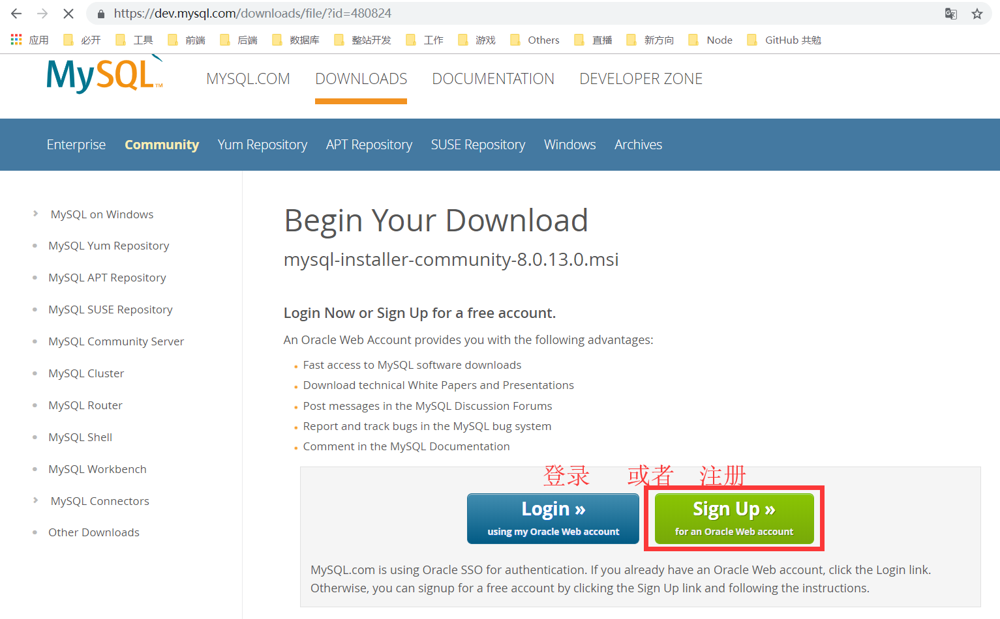
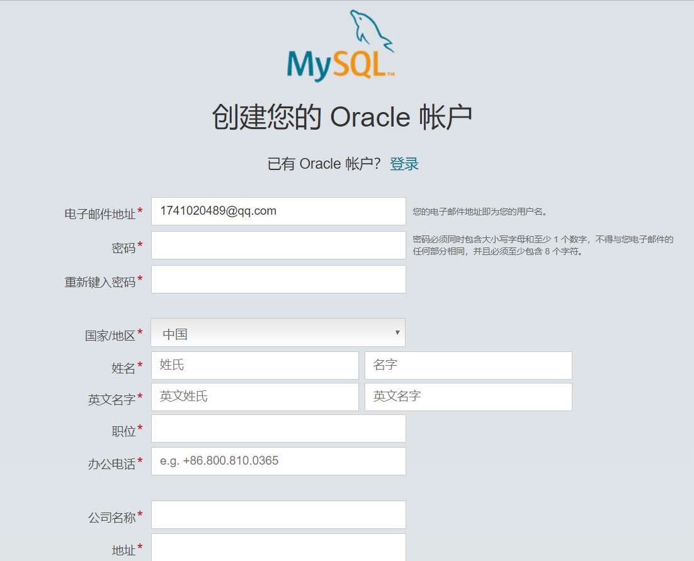
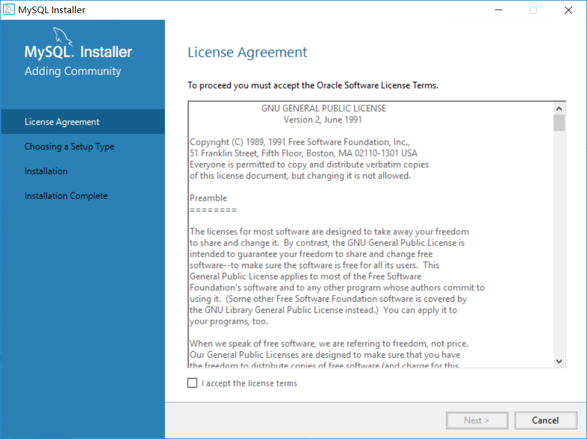
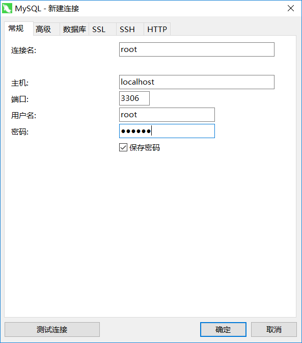
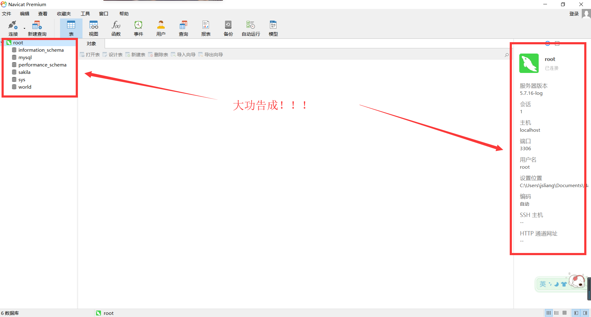

MySQL 安装
===

> Create by **jsliang** on **2018-12-13 08:49:41**  
> Recently revised in **2019-05-30 20:31:52**

**一切的折腾，均要有个度。并且，明白自己折腾的目的。**  

## <a name="chapter-one" id="chapter-one">一 目录</a>

**不折腾的前端，和咸鱼有什么区别**

| 目录 |                                                                             
| --- | 
| [一 目录](#chapter-one) | 
| [二 前言](#chapter-two) |
| [三 下载](#chapter-three) |
| [四 安装](#chapter-four) |
| [五 总结](#chapter-five) |

## <a name="chapter-two" id="chapter-two">二 前言</a>

MySQL 是什么呢？MySQL 是最流行的关系数据库管理系统之一，体积小、速度快、总体成本低的缘故导致中小型网站的开发都乐意选用 MySQL。  

Long long ago，**jsliang** 曾跟随大学老师，学习过 SQLserver，那时候的 SQL，纯粹是用 SQL 语句建表，各种秀……后来，为了应付毕设，囫囵吞枣，学习了 MongoDB，用 Express 连接它进行各种操作。当然，关系型数据库和非关系型数据库的区别将我折腾地体无完肤。  

最近要学习 Node 基础，思来想去考虑一番，还是打算连接 MySQL，无他，因为正经学过关系型数据库而已。  

## <a name="chapter-three" id="chapter-three">三 下载</a>

在这里，咱是用 Window 系统进行的下载安装，各位看官如果是用 Mac 或者其他，请看：

* [Window 安装 MySQL 全攻略 | 博客园 - Smile_Coding](https://www.cnblogs.com/ayyl/p/5978418.html)
* [Linux 安装 MySQL | 百度经验](https://jingyan.baidu.com/article/fec7a1e5f8d3201190b4e782.html)

如果上面两篇都无法满足大佬需求，请自行百度或者 google。

那么下面开始安装：

1. 直接打开 MySQL 下载页面：[地址](https://dev.mysql.com/downloads/mysql/)
2. 选择系统 Windows
3. 点击下载 MSI 安装包

然后，它会弹出窗口告诉你，需要登录或者注册：

**jsliang** 没有自己的账号，所以需要注册，但是点开注册页面，发现自己又不想注册了（太多账号了！不想再搞事情了），所以咱直接下载比较旧的版本吧：

* [MySQL 版本5.7 MSI 安装包](http://cdn.mysql.com//Downloads/MySQLInstaller/mysql-installer-community-5.7.16.0.msi)

> 最新版本是 8.0.13

双击打开，点击一系列确认后（Windows 10 安全机制会弹窗），弹出安装界面：

## <a name="chapter-four" id="chapter-four">四 安装</a>

那么现在开始正式安装，除了这里贴出的需要注意的地方，大致一路 `Next` 下去就 OK 了。

> **主要安装需要注意的地方为前 4 个步骤，请小伙伴们注意。**

**步骤 1**. 在 **Account and Roles** 这块地方，它会询问到 **MySQL Root Password** 以及 **Repeat Password**，就是让你设置根数据库的登录密码，所以设置个比较容易记的密码并记到手机或者笔记吧。

> 比较容易记是怕小伙伴忘记，如果你的数据库非常值钱，还是搞个复杂的吧~

**步骤 2**. 在 **Connect To Server** 这部分，它会提示你设置用户和密码，这里的 **User：root** 是它默认给的，如果没其他需要，那就按它这个不动就行了，然后输入第 1 步中的密码，点击 `Next` 即可。

**步骤 3**. 这一步需要重新输入一次账号密码，然后点击红框中的 **Check**，报绿了点 **Next** 即可。

**步骤 4**. 到了 **Install Complete** 这一步，表明你已经搞定地 7788 了，点 **Finish** 结束安装。

**步骤 5**. 在第 4 步点击 **Finish** 后，它会弹出一个窗口，这里还不需要管它是啥，点击 **×** 关闭即可。

**步骤 6**. 键盘按 `Win` 键或者直接用鼠标点开 **开始菜单**，会看到它提示我们最近安装了个 `MySQL`，如果是 `win7`，应该也可以找到下面这个，点击打开它。

**步骤 7**. 在第 6 步点击后，它会弹个小黑框，让你先输入密码，密码正确后，你就可以使用 MySQL 了。如果是初次学习的 SQL，推荐去学习下 SQL 命令，照着黑窗口多敲两句 SQL 语句。

**步骤 8**. MySQL 的小黑框虽然有些装逼，但是现在是什么年代，操作个数据库还要敲大量 SQL 语句，对 **jsliang** 这前端人员来说，这太难以接受了，还是安装个 **图形化工具** 吧：

* [navicat premium 64位 v12 特别版](https://www.cr173.com/soft/126934.html)

**首先**，打开上面的网址。

**然后**，将页面拉到下面，选择下图红框中的任一地址下载。

**最后**，进行安装破解：

* 解压文件夹，安装原版程序。
* 不要运行程序！！！不要运行程序！！！不要运行程序！！！重要的事情说三遍，因为破解前运行了程序会导致破解冲突。
* 根据 txt 的解说，将补丁安装到对应目录。
* 运行补丁程序，打补丁
* 操作成功！

**步骤 9**. 打开这个图形化工具，点击 **文件 -> 新建连接 -> MySQL**：

**步骤 10**.  输入前面步骤提到的账号密码，点击 **确定**：

**步骤 11**. 这时候可以看到我们的 **root** 数据库打开了，大功告成：

## <a name="chapter-five" id="chapter-five">五 总结</a>

在这篇文章中，我们提到了 MySQL 的下载、安装以及图形化工具的安装。

有些小伙伴对这些安装的感到最烦躁，因为这也要安装，那也要安装的，实在太烦了。  

但是这又是必要的步骤，只有前面的搭建好了，后面我们进行 Node 连接 MySQL 数据库就轻便多了。  

---

