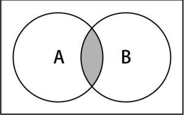
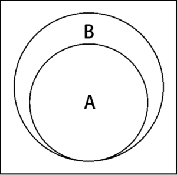
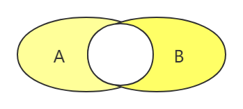

数据结构 - 集合
===

> Create by **jsliang** on **2019-09-05 11:07:17**  
> Recently revised in **2020-3-23 08:29:35**

## 一 目录

**不折腾的前端，和咸鱼有什么区别**

| 目录 |
| --- | 
| [一 目录](#chapter-one) | 
| [二 前言](#chapter-two) |
| [三 JS 仿造 Set](#chapter-three) |
| &emsp;[3.1 仿造 Set 完整实现](#chapter-three-one) |
| &emsp;[3.2 包含元素：has()](#chapter-three-two) |
| &emsp;[3.3 新增删除：add()、remove()](#chapter-three-three) |
| &emsp;[3.4 清空、查看长度、查看元素：clear()、size()、values()](#chapter-three-four) |
| &emsp;[3.5 并集：union()](#chapter-three-five) |
| &emsp;[3.6 交集：intersection()](#chapter-three-six) |
| &emsp;[3.7 差集；difference()](#chapter-three-seven) |
| &emsp;[3.8 子集：subset()](#chapter-three-eight) |
| &emsp;[3.9 对等差分：symmetricDifference()](#chapter-three-night) |
| [四 ES6 扩展 Set](#chapter-four) |
| [五 LeetCode 刷题](#chapter-five) |
| [六 总结](#chapter-six) |
| [七 参考文献](#chapter-seven) |

## 二 前言


无论是在 LeetCode 的刷题过程中，异或是工作过程中，我们都会使用到 ES6 的 `Set`，这个关于集合操作的数据结构。

谈起集合，我们应该会想到：

* 班级
* 种类
* ……

在集合中，它的特点就是 **不允许值重复**。

在班级里，每一个个体都是不同的；在种类中，每个种类有各自的特点……

所以，在 JavaScript 中：

* **集合是一种不允许值重复存在的顺序数据结构**。

在这里，我们会学到各种操作：

* 创建集合
* 给集合添加值
* 移除集合中的值
* 搜索集合值是否存在
* 操作集合：并集、交集、差集等

那么，Here we go~

## 三 JS 仿造 Set


什么是集合？

集合是由一组无序且唯一（即不能重复）的项组成的。

这个数据结构使用了与有限集合相同的数学概念，但应用到计算机科学的数据结构中。

* 自然数集合：`N = {0, 1, 2, 3, 4, 5, ...}`
* 空集：`N = {}`

像上面，我们就看到两种集合。

### 3.1 仿造 Set 完整实现


如果我们在 Chrome 浏览器控制台中敲下：

```js
const set = new Set();
set.add(1);
```

然后就会看到弹出：

```js
Set() {
  size: 1,
  __proto: Set {
    add: f add()
    clear: f clear()
    constructro(): f Set()
    delete: f delete()
    entries: f entries()
    forEach: f forEach()
    has: f has()
    keys: f values()
    size: 1
    values: f values()
    ...
  }
  [[Entries]]: Array(1)
}
```

可以看到它所拥有的方法还是挺全面的，下面我们将一一实现：

* 包含元素：`has()`
* 新增删除：`add()`、`remove()`
* 清空、查看长度、查看元素：`clear()`、`size()`、`values()`
* 并集：`union()`
* 交集：`intersection()`
* 差集：`difference()`
* 子集：`subset()`
* 对等差分：`symmerticDifference()`

这里可以先一览总体代码：

> 集合实现 - Object 版

```js
const jsliangSet = function() {
  // 通过对象设置 Set
  let items = {};

  // 包含元素：如果值在集合中，返回 true，否则返回 false
  this.has = function(value) {
    return items.hasOwnProperty(value);
  };

  // 新增：向集合添加一个新的项
  // 考虑到链式调用 set.add()，返回 this
  this.add = function(value) {
    if (!this.has(value)) {
      items[value] = value;
    }
    return this;
  };

  // 删除：从集合移除一个值
  this.delete = function(value) {
    if (this.has(value)) {
      delete items[value];
      return true;
    }
    return false;
  };

  // 清空：移除集合中的所有项
  this.clear = function() {
    items = {};
  };

  // 查看长度：返回集合所包含的元素的数量（length）
  this.size = function() {
    // return Object.keys(items).length; // 兼容性问题
    let count = 0;
    for (let key in items) {
      count++;
    }
    return count;
  };

  // 查看元素：返回一个包含集合中所有值的数组
  this.values = function() {
    const values = [];
    for (let key in items) {
      values.push(items[key]);
    }
    return values;
  };

  // 打印：直接查看集合
  this.print = function() {
    console.log(items);
  }

  // 取并集
  this.union = function(otherSet) {
    let unionSet = new jsliangSet();

    let values = this.values();
    for (let i = 0; i < values.length; i++) {
      unionSet.add(values[i]);
    }

    values = otherSet.values();
    for (let i = 0; i < values.length; i++) {
      unionSet.add(values[i]);
    }

    return unionSet;
  }

  // 取交集
  this.intersection = function(otherSet) {
    let intersectionSet = new jsliangSet();

    let values = this.values();
    for (let i = 0; i < values.length; i++) {
      if (otherSet.has(values[i])) {
        intersectionSet.add(values[i]);
      }
    }

    return intersectionSet;
  }

  // 取差集
  this.difference = function(otherSet) {
    let differenceSet = new jsliangSet();

    let values = this.values();
    for (let i = 0; i < values.length; i++) {
      if (!otherSet.has(values[i])) {
        differenceSet.add(values[i]);
      }
    }

    return differenceSet;
  }

  // 判断子集
  this.subset = function(otherSet) {
    if (this.size() > otherSet.size()) {
      return false;
    } else {
      let values = this.values();
      for (let i = 0; i < values.length; i++) {
        if (!otherSet.has(values[i])) {
          return false;
        }
      }
      return true;
    }
  }

    // 对等差分
  this.symmerticDifference = function(otherSet) {
    let symmerticDifferenceSet = new jsliangSet();

    let values = this.values();
    for (let i = 0; i < values.length; i++) {
      if (!otherSet.has(values[i])) {
        symmerticDifferenceSet.add(values[i]);
      }
    }
    let otherValues = otherSet.values();
    for (let j = 0; j < otherValues.length; j++) {
      if (!this.has(otherValues[j])) {
        symmerticDifferenceSet.add(otherValues[j]);
      }
    }
    return symmerticDifferenceSet;
  }
}

const A = new jsliangSet();

A.add(1);

A.print();
```

当然，我们也可以通过 数组（Array）的方式实现集合

> 集合实现 - Array 版

```js
const jsliangSet = function() {
  // 通过数组设置 Set
  let items = [];

  // 包含元素：如果值在集合中，返回 true，否则返回 false
  this.has = function(value) {
    return items.includes(value);
  };

  // 新增：向集合添加一个新的项
  // 考虑到链式调用 set.add()，返回 this
  this.add = function(value) {
    if (!this.has(value)) {
      items.push(value);
    }
    return this;
  };

  // 删除：从集合移除一个值
  this.delete = function(value) {
    if (this.has(value)) {
      items.splice(items.indexOf(value), 1);
      console.log('true');
      return true;
    }
    console.log('false');
    return false;
  };

  // 清空：移除集合中的所有项
  this.clear = function() {
    items = [];
  };

  // 查看长度：返回集合所包含的元素的数量（length）
  this.size = function() {
    return items.length;
  };

  // 获取：将 items 返回出去
  this.getItems = function() {
    return items;
  }

  // 打印：直接查看集合
  this.print = function() {
    console.log(items);
  }

  // 取并集
  this.union = function(otherSet) {
    const unionSet = new jsliangSet();

    const now = this.getItems();
    for (let i = 0; i < now.length; i++) {
      unionSet.add(now[i]);
    }
    
    const other = otherSet.getItems();
    for (let j = 0; j < other.length; j++) {
      unionSet.add(other[j]);
    }

    return unionSet;
  }

  // 取交集
  this.intersection = function(otherSet) {
    const intersectionSet = new jsliangSet();

    const now = this.getItems();
    for (let i = 0; i < now.length; i++) {
      if (otherSet.has(now[i])) {
        intersectionSet.add(now[i]);
      }
    }

    return intersectionSet;
  }

  // 取差集
  this.difference = function(otherSet) {
    const differenceSet = new jsliangSet();

    const now = this.getItems();
    for (let i = 0; i < now.length; i++) {
      if (!otherSet.has(now[i])) {
        differenceSet.add(now[i]);
      }
    }

    return differenceSet;
  }

  // 判断子集
  this.subset = function(otherSet) {
    if (this.size() > otherSet.size()) {
      return false;
    } else {
      const now = this.getItems();
      for (let i = 0; i < now.length; i++) {
        if (!otherSet.has(now[i])) {
          return false;
        }
      }
      return true;
    }
  }

  // 对等差分
  this.symmerticDifference = function(otherSet) {
    const symmerticDifferenceSet = new jsliangSet();

    const now = this.getItems();
    for (let i = 0; i < now.length; i++) {
      if (!otherSet.has(now[i])) {
        symmerticDifferenceSet.add(now[i]);
      }
    }

    const other = otherSet.getItems();
    for (let j = 0; j < other.length; j++) {
      if (!this.has(other[j])) {
        symmerticDifferenceSet.add(other[j]);
      }
    }

    return symmerticDifferenceSet;
  }
}

const set = new jsliangSet();

console.log('---基本操作---');

set.add(1).add(1).add(2).add(3);

set.print();

console.log(set.has(1));

set.delete(2); // true
set.delete(4); // false

set.print();

const A = new jsliangSet();

A.add(1);
A.add(2);
A.add(3);

const B = new jsliangSet();

B.add(2);
B.add(3);
B.add(4);

console.log('---取并集---');
const unionAB = A.union(B);
console.log(unionAB.getItems());

console.log('---取交集---');
const intersectionAB = A.intersection(B);
console.log(intersectionAB.getItems());

console.log('---取差集---');
const differenceAB = A.difference(B);
console.log(differenceAB.getItems());

console.log('---判断子集---');
const subsetAB = B.subset(A);
console.log(subsetAB);

console.log('---对等差分---');
const symmerticDifferenceAB = A.symmerticDifference(B);
console.log(symmerticDifferenceAB.getItems());
```

### 3.2 包含元素：has()


前面说了这么多，让我们回顾下集合：

* 自然数集合：`N = {0, 1, 2, 3, 4, 5, ...}`
* 空集：`N = {}`

很容易看到，如果一个集合没有任何元素，那么它就是 `{}` 空的，这里我们用空对象表示。

如果一个集合有元素，那么它就像自然数集合一样，拥有许多元素。

那么，我们将集合通过 Object（即 `{}`）的形式做出来。

下面实现 `Set.has()` 功能。

```js
const jsliangSet = function() {
  // 通过对象设置 Set
  let items = {};

  // 包含元素：如果值在集合中，返回 true，否则返回 false
  this.has = function(value) {
    return items.hasOwnProperty(value);
  };
}
```

为了避免和 ES6 的 Set 造成命名冲突，给小伙伴们带来误解，这里咱们命名为 `jsliangSet`。

* `let items = {}`。初始化 `Set`。
* `this.has = function() {}`。用来判断某个元素是否存在于 `Set()` 集合中。

为什么第一个学习的是 `has()`，而不是 `add()` 亦或者 `delete()`？

假设有一个集合：`{0, 1, 2, 3}`，你需要添加 `2`，你是不是需要判断 `2` 在不在这个集合中？如果它存在了，你还是添加进去，这是不是不符合 **集合** 的规则？

假设有一个集合：`{0, 1, 2, 3}`，你需要删除 `1`，你是不是需要判断 `1` 在不在这个集合中？如果没有，你是不是做了无用功？

> `hasOwnProperty()` 方法返回一个布尔值，指示对象自身属性中是否具有指定的属性（即是否有指定的键）

> 更多可以前往【MDN】`Object.property.hasOwnProperty` 学习了解：https://developer.mozilla.org/zh-CN/docs/Web/JavaScript/Reference/Global_Objects/Object/hasOwnProperty

### 3.3 新增删除：add()、remove()


在前面中，我们通过 `Object` 的方法 `hasOwnProperty()` 判断了这个元素是否存在于集合中，那么下面我们就可以实现新增和删除的方法：

```js
const jsliangSet = function() {
  // 通过对象设置 Set
  let items = {};

  // 包含元素：如果值在集合中，返回 true，否则返回 false
  this.has = function(value) {
    return items.hasOwnProperty(value);
  };

  // 新增：向集合添加一个新的项
  // 考虑到链式调用 set.add()，返回 this
  this.add = function(value) {
    if (!this.has(value)) {
      items[value] = value;
    }
    return this;
  };

  // 删除：从集合移除一个值
  this.delete = function(value) {
    if (this.has(value)) {
      delete items[value];
      return true;
    }
    return false;
  };

  // 打印集合
  this.print = function(value) {
    console.log(items);
  }
}

const set = new jsliangSet();

set.add(1).add(1).add(2).add(3);
set.print();
// { '1': 1, '2': 2, '3': 3 }

set.delete(2);
set.print();
// { '1': 1, '3': 3 }
```

* **新增 `add()` 步骤**：

1. 通过 `has()` 判断这个元素不存在集合中，那么就新增它；
2. 如果这个元素存在于集合中，那么就不理会。

这里我们需要注意，我们给这个 `Set()` 设置的是 `key = value` 的形式，这样我们方便进行一些其他操作，例如删除 `delete()` 或者查看长度 `size()` 等。

然后为了能让它可以链式调用，我们返回了 `this`，这样它可以不断添加。

* **删除 `delete()` 步骤**：

1. 通过 `has()` 判断这个元素不存在集合中，则不理会；
2. 如果这个元素存在于集合中，那么就通过 `delete` 这个操作符删除它。

> `delete` 操作符用于删除对象的某个属性；如果没有指向这个属性的引用，那它最终会被释放。

> 更多可以前往【MDN】`delete` 操作符学习了解：https://developer.mozilla.org/zh-CN/docs/Web/JavaScript/Reference/Operators/delete

小伙伴们可以仔细阅读两遍这个方法，因为其实现还是挺简单的。

【拓展】

如果小伙伴们还有想法，那么也可以思考下：

* 如何让它一次性添加多个元素或者删除多个元素？

这里 **jsliang** 脑洞大开，觉得连续调用 `add()` 的方法满足不了，咱们为何不通过数组，将多个元素放到数组中，让它逐个添加或者删除？

```js
const jsliangSet = function() {
  // 通过对象设置 Set
  let items = {};

  // 包含元素：如果值在集合中，返回 true，否则返回 false
  this.has = function(value) {
    return items.hasOwnProperty(value);
  };

  // 多个新增：向集合添加多个元素
  this.addList = function(list) {
    for (let i = 0; i < list.length; i++) {
      if (!this.has(list[i])) {
        items[list[i]] = list[i];
      }
    }
    return this;
  };

  // 多个删除：删除集合中多个元素
  this.deleteList = function(list) {
    for (let i = 0; i < list.length; i++) {
      if (this.has(list[i])) {
        delete items[list[i]];
      }
    }
    return this;
  };

  // 打印集合
  this.print = function(value) {
    console.log(items);
  }
}

const set = new jsliangSet();

set.addList([1, 2, 3, 4, 5, 6]);
set.print();
// { '1': 1, '2': 2, '3': 3, '4': 4, '5': 5, '6': 6 }

set.deleteList([4, 5, 6, 7]);
set.print();
// { '1': 1, '2': 2, '3': 3 }
```

当然，这方法仅仅是因为 **无聊** 且觉得 **有可能有用**，假设以后你想改造 ES6 的 `Set()` 方法的时候，需要这样的东东，说不定还有小小思路~

### 3.4 清空、查看长度、查看元素：clear()、size()、values()


下面我们接着实现 3 个方法：

* 清空：`clear()`
* 查看长度：`size()`
* 查看元素：`values()`

```js
const jsliangSet = function() {
  // 通过对象设置 Set
  let items = {};

  // 包含元素：如果值在集合中，返回 true，否则返回 false
  this.has = function(value) {
    return items.hasOwnProperty(value);
  };

  // 新增：向集合添加一个新的项
  // 考虑到链式调用 set.add()，返回 this
  this.add = function(value) {
    if (!this.has(value)) {
      items[value] = value;
    }
    return this;
  };

  // 清空：移除集合中的所有项
  this.clear = function() {
    items = {};
  };

  // 查看长度：返回集合所包含的元素的数量（length）
  this.size = function() {
    // return Object.keys(items).length; // 兼容性问题
    let count = 0;
    for (let key in items) {
      count++;
    }
    return count;
  };

  // 查看元素：返回一个包含集合中所有值的数组
  this.values = function() {
    const values = [];
    for (let key in items) {
      values.push(items[key]);
    }
    return values;
  };

  // 打印集合
  this.print = function(value) {
    console.log(items);
  }
}

const set = new jsliangSet();

set.add(1).add(2).add(3);
set.print();
// { '1': 1, '2': 2, '3': 3 }

console.log(set.size()); // 3
console.log(set.values()); // [1, 2, 3]
set.clear();
set.print(); // {}
```

* 清空 `clear()`

假设你需要清空一个数组，你会一个一个的 `pop()` 来清空？

假设你需要清空一个对象，你会一个一个的 `delete` 来删除？

不会，聪明如你，肯定机智：

```js
let arr = [1, 2, 3];
let obj = {1, 2, 3};

arr = [];
obj = {};
```

搞定收工，所以 `Set.clear()` 的方法你也可以瞬间得知了~

* 查看长度 `size()`

关于查看元素，这里有两种实现思路：

> 方法一

```js
this.size = function() {
  return Object.keys(items).length; // 兼容性问题
};
```

`Object.keys()` 返回一个所有元素为字符串的数组，其元素来自于从给定的 `Object` 上面可枚举的属性。

即：将所有的 `key` 给收集起来。

```js
const obj = {'1': 1, '2': 2, '3': 3};
console.log(Object.keys(obj));
// ['1', '2', '3']
```

这样我们就可以快速获得集合的长度。

当然，为什么不用它？因为它有兼容性，这点需要特别强调，当今使用 IE6/7/8 的公司不是没有，所以有时候问你这个的时候，需要知道它的兼容性。

当然如果你实在想不出什么理由去兼容 IE6/7/8 的公司，那么大胆使用它吧！

> 更多可以前往【MDN】`Object.keys()` 学习了解：https://developer.mozilla.org/zh-CN/docs/Web/JavaScript/Reference/Global_Objects/Object/keys

> 方法二

```js
this.size = function() {
  let count = 0;
  for (let key in items) {
    count++;
  }
  return count;
};
```

相对于 `Object.keys()`，方法二可能就需要写多几行代码了：

1. 设置 `count` 进行统计。
2. 遍历集合 `items`。
3. 判断 `items` 中 `key` 是否存在，如果存在则将 `count++`。

> `for...in` 语句以任意顺序遍历一个对象的除 Symbol 以外的可枚举属性。

> 更多可以前往【MDN】`for...in` 语句学习了解：https://developer.mozilla.org/zh-CN/docs/Web/JavaScript/Reference/Statements/for...in

当然，对于学渣来说，只能多学学，所以顺带看了下 `for...in` 和 `for...of` 比对：

> 【廖雪峰】iterable：https://www.liaoxuefeng.com/wiki/1022910821149312/1023024358748480

* 查看元素 `values()`

关于查看元素 `values()`，这里还是觉得有点想写的更好，但是又怕写砸了的感觉，本来想使用 `iterable` 设置，但是又怕讲着讲着兜晕了，所以这里使用数组返回来代替 `iterable` 类型了。

```js
this.values = function() {
  const values = [];
  for (let key in items) {
    values.push(items[key]);
  }
  return values;
};
```

> 更多可以结合廖雪峰关于 `iterable` 类型以及下面的一篇实现文章一起看看【CSDN】xcxiang《ES6学习（三）之Set的模拟实现》：https://blog.csdn.net/xingaichenai/article/details/88780119

### 3.5 并集：union()


讲到这里，我们就对 `Set` 的基础方法 `has()`、`add()`、`delete()`、`clear()`、`size()`、`values()` 等有所了解了。

下面我们学习下在操作 Set 的过程中，会涉及的 4 种操作：

* 并集：`union()`
* 交集：`intersection()`
* 差集：`difference()`
* 子集：`subset()`
* 对等差分：`symmerticDifference()`

> 其实这块也挺简单的，理解了它的内容那么很快就可以学习到这些方法

* **并集**：对于给定的两个集合，返回一个包含两个集合中所有元素的新集合。

并集用数组表示：

```js
const a = [1, 2, 3];
const b = [2, 3, 4];
const c = a.union(b);
// c = [1, 2, 3, 4];
```

说白了，并集就是两个集合相加，用图表示为：


> **jsliang** 补习班在线辅导初中/高中数学，哈哈

那么，它们怎么用代码表示呢？

```js
const jsliangSet = function() {
  // 通过对象设置 Set
  let items = {};

  // 包含元素：如果值在集合中，返回 true，否则返回 false
  this.has = function(value) {
    return items.hasOwnProperty(value);
  };

  // 新增：向集合添加一个新的项
  // 考虑到链式调用 set.add()，返回 this
  this.add = function(value) {
    if (!this.has(value)) {
      items[value] = value;
    }
    return this;
  };

  // 查看元素：返回一个包含集合中所有值的数组
  this.values = function() {
    const values = [];
    for (let key in items) {
      if (items.hasOwnProperty(key)) {
        values.push(items[key]);
      }
    }
    return values;
  };

  // 取并集
  this.union = function(otherSet) {
    let unionSet = new jsliangSet();

    let values = this.values();
    for (let i = 0; i < values.length; i++) {
      unionSet.add(values[i]);
    }

    values = otherSet.values();
    for (let i = 0; i < values.length; i++) {
      unionSet.add(values[i]);
    }

    return unionSet;
  }
}

const A = new jsliangSet();

const set = new jsliangSet();

A.add(1);
A.add(2);
A.add(3);

const B = new jsliangSet();

B.add(2);
B.add(3);
B.add(4);

const unionAB = A.union(B);
console.log(unionAB.values());
// [ 1, 2, 3, 4 ]
```

方法很简单：

1. 生成一个新的 `Set`：`unionSet`。
2. 遍历 `A`，将其所有元素添加到 `unionSet` 中。
3. 遍历 `B`，将其所有元素添加到 `unionSet` 中。
4. 因为 `Set` 会过滤重复元素，所以这样所有元素就添加过来了。

这就是 `union` 的实现~

### 3.6 交集：intersection()


* **交集**：对于给定的两个集合，返回一个包含两个集合中共有元素的新集合。

交集用数组表示：

```js
const a = [1, 2, 3];
const b = [2, 3, 4];
const c = a.intersection(b);
// c = [2, 3];
```

说白了，并集就是两个集合共同的地方，用图表示为：



那么咱们再看看代码实现：

```js
const jsliangSet = function() {
  // 通过对象设置 Set
  let items = {};

  // 包含元素：如果值在集合中，返回 true，否则返回 false
  this.has = function(value) {
    return items.hasOwnProperty(value);
  };

  // 新增：向集合添加一个新的项
  // 考虑到链式调用 set.add()，返回 this
  this.add = function(value) {
    if (!this.has(value)) {
      items[value] = value;
    }
    return this;
  };

  // 查看元素：返回一个包含集合中所有值的数组
  this.values = function() {
    const values = [];
    for (let key in items) {
      if (items.hasOwnProperty(key)) {
        values.push(items[key]);
      }
    }
    return values;
  };

  // 取交集
  this.intersection = function(otherSet) {
    let intersectionSet = new jsliangSet();

    let values = this.values();
    for (let i = 0; i < values.length; i++) {
      if (otherSet.has(values[i])) {
        intersectionSet.add(values[i]);
      }
    }

    return intersectionSet;
  }
}

const A = new jsliangSet();

const set = new jsliangSet();

A.add(1);
A.add(2);
A.add(3);

const B = new jsliangSet();

B.add(2);
B.add(3);
B.add(4);

const intersectionAB = A.intersection(B);
console.log(intersectionAB.values());
// [ 2, 3 ]
```

相对于并集而言，交集更加容易查找：

* 判断所有 A 中的元素同时存在于 B 中即可~

### 3.7 差集；difference()


* **差集**：对于给定的两个集合，返回一个包含所有存在于第一个集合且不存在于第二个集合的元素的新集合。

差集用数组表示：

```js
const a = [1, 2, 3];
const b = [2, 3, 4];
const c = a.difference(b);
// c = [1];
```

说白了，并集就是两个集合相减，看下会剩下哪些元素，用图表示为：


用代码表示为：

```js
const jsliangSet = function() {
  // 通过对象设置 Set
  let items = {};

  // 包含元素：如果值在集合中，返回 true，否则返回 false
  this.has = function(value) {
    return items.hasOwnProperty(value);
  };

  // 新增：向集合添加一个新的项
  // 考虑到链式调用 set.add()，返回 this
  this.add = function(value) {
    if (!this.has(value)) {
      items[value] = value;
    }
    return this;
  };

  // 查看元素：返回一个包含集合中所有值的数组
  this.values = function() {
    const values = [];
    for (let key in items) {
      if (items.hasOwnProperty(key)) {
        values.push(items[key]);
      }
    }
    return values;
  };

  // 取差集
  this.difference = function(otherSet) {
    let differenceSet = new jsliangSet();

    let values = this.values();
    for (let i = 0; i < values.length; i++) {
      if (!otherSet.has(values[i])) {
        differenceSet.add(values[i]);
      }
    }

    return differenceSet;
  }
}

const A = new jsliangSet();

const set = new jsliangSet();

A.add(1);
A.add(2);
A.add(3);

const B = new jsliangSet();

B.add(2);
B.add(3);
B.add(4);

const differenceAB = A.difference(B);
console.log(differenceAB.values());
// [ 1 ]
```

上面的代码希望小伙伴们能够在不看它的情况下，也能自行实现~

### 3.8 子集：subset()


* **子集**：验证一个给定集合是否是另一个集合的子集。

子集判断用数组表示：

```js
const a = [1, 2, 3];
const b = [2, 3, 4];
a.subset(b); // false
```

说白了，并集就是两个集合相加，用图表示为：



用代码表示为：

```js
const jsliangSet = function() {
  // 通过对象设置 Set
  let items = {};

  // 包含元素：如果值在集合中，返回 true，否则返回 false
  this.has = function(value) {
    return items.hasOwnProperty(value);
  };

  // 新增：向集合添加一个新的项
  // 考虑到链式调用 set.add()，返回 this
  this.add = function(value) {
    if (!this.has(value)) {
      items[value] = value;
    }
    return this;
  };

  // 查看元素：返回一个包含集合中所有值的数组
  this.values = function() {
    const values = [];
    for (let key in items) {
      if (items.hasOwnProperty(key)) {
        values.push(items[key]);
      }
    }
    return values;
  };

  // 查看长度：返回集合所包含的元素的数量（length）
  this.size = function() {
    // return Object.keys(items).length; // 兼容性问题
    let count = 0;
    for (let key in items) {
      if (items.hasOwnProperty(key)) {
        count++;
      }
    }
    return count;
  };

  // 判断子集
  this.subset = function(otherSet) {
    if (this.size() > otherSet.size()) {
      return false;
    } else {
      let values = this.values();
      for (let i = 0; i < values.length; i++) {
        if (!otherSet.has(values[i])) {
          return false;
        }
      }
      return true;
    }
  }
}

const A = new jsliangSet();

const set = new jsliangSet();

A.add(1);
A.add(2);
A.add(3);

const B = new jsliangSet();

B.add(2);
B.add(3);
B.add(4);

const subsetAB = B.subset(A);
console.log(subsetAB); // false
```

这里就不详解了~

### 3.9 对等差分：symmetricDifference()


* **对等差分**：两个集合交集之外的部分。

对等差分用数组表示：

```js
const a = [1, 2, 3];
const b = [2, 3, 4];
const c = a.symmetricDifference(b);
// c = [1, 4]
```

用图表示为：



> 黄色部分

用代码表示为：

```js
const jsliangSet = function() {
  // 通过对象设置 Set
  let items = {};

  // 包含元素：如果值在集合中，返回 true，否则返回 false
  this.has = function(value) {
    return items.hasOwnProperty(value);
  };

  // 新增：向集合添加一个新的项
  // 考虑到链式调用 set.add()，返回 this
  this.add = function(value) {
    if (!this.has(value)) {
      items[value] = value;
    }
    return this;
  };

  // 查看元素：返回一个包含集合中所有值的数组
  this.values = function() {
    const values = [];
    for (let key in items) {
      if (items.hasOwnProperty(key)) {
        values.push(items[key]);
      }
    }
    return values;
  };

  // 对等差分
  this.symmerticDifference = function(otherSet) {
    let symmerticDifferenceSet = new jsliangSet();

    let values = this.values();
    for (let i = 0; i < values.length; i++) {
      if (!otherSet.has(values[i])) {
        symmerticDifferenceSet.add(values[i]);
      }
    }
    let otherValues = otherSet.values();
    for (let j = 0; j < otherValues.length; j++) {
      if (!this.has(otherValues[j])) {
        symmerticDifferenceSet.add(otherValues[j]);
      }
    }
    return symmerticDifferenceSet;
  }
}

const A = new jsliangSet();

const set = new jsliangSet();

A.add(1);
A.add(2);
A.add(3);

const B = new jsliangSet();

B.add(2);
B.add(3);
B.add(4);

const symmerticDifferenceAB = A.symmerticDifference(B);
console.log(symmerticDifferenceAB.values());
// [ 1, 4 ]
```

到此，我们就通过原生 JavaScript 实现了 ES6 的 `Set()` 方法。

> 原生实现原生，没毛病

主要是为了让我们对 `Set()` 有更深入的了解，从而方便我们进行下面 ES6 扩展 `Set()` 的实现。

## 四 ES6 扩展 Set


如果你仔细跟进了上面的 `Set` 仿造，那么应该知道如何取交集、并集、对等差分、差集，以及判断子集。

同时，你应该也知道 ES6 的 `Set` 是不包括这些操作的，这就给了我们拓展的空间！

为此，在 MDN 的 `Set` 目录上，你也可以看到它在【实现基本集合操作】上写了相关的 `Set` 扩展方法，这里 **jsliang** 偷懒就不贴代码了，感兴趣的小伙伴可以上去看看：

* [【MDN】Set](https://developer.mozilla.org/zh-CN/docs/Web/JavaScript/Reference/Global_Objects/Set)

值得一提的是，**jsliang** 还是想实现【Array】【Set】都能共用的操作方法：

> Object 没必要去重等操作，因为它的键（key）是唯一的。

```js
// 取并集
const union = (set, otherSet) => {
  return [...new Set([...set, ...otherSet])];
};

// 取交集
const intersection = (set, otherSet) => {
  return [...set].filter(item => [...otherSet].includes(item));
};

// 对等差分
const symmerticDifference = (set, otherSet) => {
  return [...[...set].filter(item => ![...otherSet].includes(item)), ...[...otherSet].filter(item => ![...set].includes(item))];
};

// 取差集
const difference = (set, otherSet) => {
  return [...set].filter(item => ![...otherSet].includes(item));
};

// 判断子集
const subset = (set, otherSet) => {
  return [...set].filter(item => ![...otherSet].includes(item)).length === 0;
};

const A = new Set();
A.add(1).add(2).add(3);
console.log('A：', A.values()); // [Set Iterator] { 1, 2, 3 }

const B = new Set();
B.add(2).add(3).add(4);
console.log('B：', B.values()); // [Set Iterator] { 2, 3, 4 }

console.log('---取并集---');
const unionSet = union(A, B);
console.log(unionSet); // [ 1, 2, 3, 4 ]

console.log('---取交集---');
const intersectionSet = intersection(A, B);
console.log(intersectionSet); // [ 2, 3 ]

console.log('---对等差分---');
const symmerticDifferenceSet = symmerticDifference(A, B);
console.log(symmerticDifferenceSet); // [ 1, 4 ]

console.log('---取差集---');
const differenceSet = difference(A, B);
console.log(differenceSet); // [ 1 ]

console.log('---判断子集---');
const subsetSet = subset(A, B);
console.log(subsetSet); // false
```

这样，我们就对 ES6 的 `Set` 进行了扩展，如果小伙伴们对仿造 `Set` 非常了解，并能随手扩展 ES6 的 `Set`，那么我们就可以愉快地刷下面的题了！

## 五 LeetCode 刷题


集合 `Set` 去重，取交集等常见不常见？

答案是很常见，在简单题集的 200 多道题中，它在许多题目留下了自己的印迹，下面列举的题目中，小伙伴们可以根据个人情况，刷够 5 道甚至更多用来巩固自己对集合 `Set` 的了解：

1. ……
2. ……
3. ……
4. ……
5. ……
6. ……
7. ……
8. ……
9. ……
10. ……

这样，我们就进一步加深了自己对于集合 `Set` 的了解。

## 六 总结


经过 **仿造 Set -> 扩展 ES6 的 Set -> 在 LeetCode 用 Set 实战**，我们完成了对集合的学习了解。

在这个过程中，我们会产生各种各样的疑惑，我们应该及时地去解决这些疑惑，并将自己看过的文章添加到【参考文献】中。

唯有这样，我们才能尽量避免在同一个坑里往复翻爬，才能走得更远~

那么，我们下个数据结构见！

## 七 参考文献


* [【MDN】Set](https://developer.mozilla.org/zh-CN/docs/Web/JavaScript/Reference/Global_Objects/Set)
* [【MDN】delete](https://developer.mozilla.org/zh-CN/docs/Web/JavaScript/Reference/Operators/delete)
* [【MDN】hasOwnProperty()](https://developer.mozilla.org/zh-CN/docs/Web/JavaScript/Reference/Global_Objects/Object/hasOwnProperty)
* [【MDN】Object.keys()](https://developer.mozilla.org/zh-CN/docs/Web/JavaScript/Reference/Global_Objects/Object/keys)
* [【MDN】`for...in`](https://developer.mozilla.org/zh-CN/docs/Web/JavaScript/Reference/Statements/for...in)
* [【CSDN】xcxiang ES6学习（三）之Set的模拟实现](https://blog.csdn.net/xingaichenai/article/details/88780119)
* [【廖雪峰的官方网站】iterable](https://www.liaoxuefeng.com/wiki/1022910821149312/1023024358748480)

---

**不折腾的前端，和咸鱼有什么区别！**


**jsliang** 会每天更新一道 LeetCode 题解，从而帮助小伙伴们夯实原生 JS 基础，了解与学习算法与数据结构。

**浪子神剑** 会每天更新面试题，以面试题为驱动来带动大家学习，坚持每天学习与思考，每天进步一点！

扫描上方二维码，关注 **jsliang** 的公众号（左）和 **浪子神剑** 的公众号（右），让我们一起折腾！

