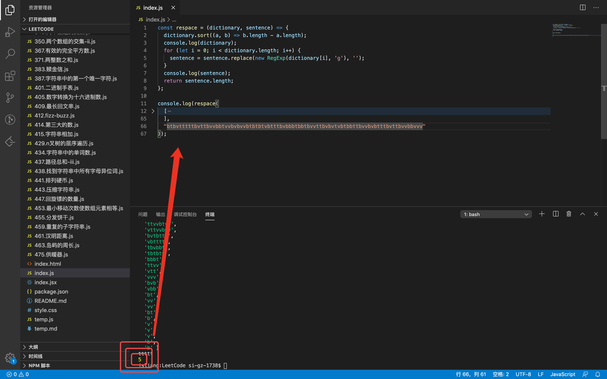

面试题 17.13 - 恢复空格
===

> Create by **jsliang** on **2020-06-16 08:57:10**  
> Recently revised in **2020-06-16 11:16:03**  

## 一 目录

**不折腾的前端，和咸鱼有什么区别**

| 目录 |
| --- |
| [一 目录](#chapter-one) |
| [二 题目](#chapter-two) |
| [三 解题思路](#chapter-three) |
| [四 统计分析](#chapter-four) |
| [五 解题套路](#chapter-five) |

## 二 题目


```
哦，不！你不小心把一个长篇文章中的空格、标点都删掉了，并且大写也弄成了小写。

像句子 "I reset the computer. It still didn’t boot!"
已经变成了 "iresetthecomputeritstilldidntboot"。

在处理标点符号和大小写之前，你得先把它断成词语。

当然了，你有一本厚厚的词典dictionary，不过，有些词没在词典里。

假设文章用sentence表示，设计一个算法，
把文章断开，要求未识别的字符最少，返回未识别的字符数。

注意：本题相对原题稍作改动，只需返回未识别的字符数

示例：
输入：
  dictionary = ["looked","just","like","her","brother"]
  sentence = "jesslookedjustliketimherbrother"
输出： 7
解释： 断句后为 "jess looked just like tim her brother"，
共7个未识别字符。

提示：
0 <= len(sentence) <= 1000
dictionary中总字符数不超过 150000。
你可以认为dictionary和sentence中只包含小写字母。

来源：力扣（LeetCode）
链接：https://leetcode-cn.com/problems/re-space-lcci
著作权归领扣网络所有。商业转载请联系官方授权，非商业转载请注明出处。
```

```js
/**
 * @param {string[]} dictionary
 * @param {string} sentence
 * @return {number}
 */
var respace = function(dictionary, sentence) {

};
```

根据上面的已知函数，小伙伴们可以先尝试破解本题，确定了自己的答案后再看下面代码。

## 三 解题思路


拿到题目的第一时间是使用正则替换，因为【字典】可能出现的次数不止一次，所以需要加上 `'g'` 替换，然后就出现：

```js
const respace = (dictionary, sentence) => {
  for (let i = 0; i < dictionary.length; i++) {
    sentence = sentence.replace(new RegExp(dictionary[i], 'g'), '');
  }
  return sentence.length;
};

// 提交后：
/*
 * 输入:
  ["looked","just","like","her","brother"]
  "jesslookedjustliketimherbrother"
 * 输出：11
 * 预期结果：7
*/
```

再看一眼题意就明白：

* 要求未识别的字符最少

所以，要不我排序一下再进行替换？

```js
const respace = (dictionary, sentence) => {
  dictionary.sort((a, b) => b.length - a.length); // 由大到小进行排序
  for (let i = 0; i < dictionary.length; i++) {
    sentence = sentence.replace(new RegExp(dictionary[i], 'g'), '');
  }
  return sentence.length;
};
```

但是，第 66 / 71 个通过测试用例的时候挂了：

```js
/*
  * 输入:
  [
    'bbvttvtvvtbvbbttvbbtbvvttbvbvbtbvvvbbbvbvbvbtvbtvvvtvvtbttbttbbvbbbttvvvbvvtb',
    'btbttbtbbvbvvbvttbttvtbbtbvtttvbbtbbtvtvvvvbbttvtvvbbbv',
    'bvvbvvttttttbtvvvttvbvtvvbvtbtvtbvttvvtbt',
    'tbvvvtttvtbvbtttvvbtvvvvtvvbvvtvvbbvbbbvb',
    'tbttbttbbbtbtvtvtvtbbbvvtbbbvbbvvvbbttvvt',
    'bvvbvbvttbvtbvvtbttvvvvtvbtvbttbbvvtvtvv',
    'btbtbtttvbbtbttbtvvttbvtbtvtbvvtbbbb',
    'bvvbbbvvvbvttbtbvtvtvvbttbbbtvvvb',
    'btttbvbbbtbbtbvvttbvbvtvbtbbttb',
    'vbvvtvbvbvbttvbvbtvbtbtvtbvbbtb',
    'btvbbvtbbvbvtvttvvbbbtbvvvtbtb',
    'vtbvvbvvvvvttvbbttbbvtvt',
    'bvvvtbbvvvbtvbvtvtvvvvbb',
    'vbtbvtvvbbvtbvvbbbvbtbbv',
    'vvtbvtvbttbttvvbvttbt',
    'tvbbtvvtvvtbtbttvvvb',
    'tbttbvvttvbtvvtbbvvv',
    'vtvvbtttvtbbvvbbtbb',
    'tvttttbbvvvbbtttvvv',
    'vvbvbvbvtbvbvvvvtv',
    'bttbvbbttvvbtvvvvb',
    'vvvvbbbtbbbvbbbb',
    'btbvbbbvbtvtbvvv',
    'ttbttvtvbtbbbbv',
    'vbvbbvvbvbbvvb',
    'ttvbbbbttbtbtb',
    'vtbvvtbbvtt',
    'bvttbvvbvb',
    'bvbbbbbbbb',
    'tvvbvbvvb',
    'ttvvbtvv',
    'vttvvbvv',
    'bvtbttv',
    'tbtbtv',
    'vbtttt',
    'tbvbbt',
    'bbbt',
    'ttvv',
    'vtt',
    'vvv',
    'bvb',
    'vbb',
    'bt',
    'vv',
    'vv',
    'bt',
    'b',
    'v',
    'v',
    'v',
    'b',
    'b',
  ],
  "btbvtttttbvttbvvbbtvvbvbvvbtbtbtvbtttbvbbbtbbtbvvttbvbvtvbtbbttbvvbvbtttbvttbvvbbvvv"
  * 输出：3
  * 预期结果：5
*/
```

不管从哪个角度来说：

1. 3 应该比 5 小是吧？
2. 本地进行打印的结果也是 5



后续咨询下 LeetCode 官方吧~

> 动态规划

```js
const respace = (dictionary, sentence) => {
  const dp = [ 0 ];
  for (let i = 1; i <= sentence.length; i++) {
    dp[ i ] = dp[i - 1] + 1;
    for (let item of dictionary) {
      if (sentence.substring(i - item.length, i) === item) {
        dp[i] = Math.min(dp[i], dp[i - item.length]);
      }
    }
  }
  return dp[dp.length - 1];
};
```

## 四 统计分析


本题暂无分析统计~

## 五 套路分析


本题暂未发现任何套路，如果有但是 **jsliang** 后面发现了的话，会在 GitHub 进行补充。

如果小伙伴有更好的思路想法，或者没看懂其中某种解法，欢迎评论留言或者私聊 **jsliang**~

---

**不折腾的前端，和咸鱼有什么区别！**


**jsliang** 会每天更新一道 LeetCode 题解，从而帮助小伙伴们夯实原生 JS 基础，了解与学习算法与数据结构。

**浪子神剑** 会每天更新面试题，以面试题为驱动来带动大家学习，坚持每天学习与思考，每天进步一点！

扫描上方二维码，关注 **jsliang** 的公众号（左）和 **浪子神剑** 的公众号（右），让我们一起折腾！

