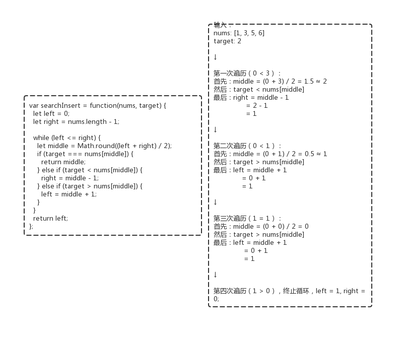

029 - 搜索插入位置（search-insert-position）
===

> Create by **jsliang** on **2019-06-10 08:54:47**  
> Recently revised in **2019-09-18 10:16:56**

## <a name="chapter-one" id="chapter-one">一 目录</a>

**不折腾的前端，和咸鱼有什么区别**

| 目录 |
| --- | 
| [一 目录](#chapter-one) | 
| [二 前言](#chapter-two) |
| [三 解题](#chapter-three) |
| &emsp;[3.1 解法 - 暴力破解](#chapter-three-one) |
| &emsp;[3.2 解法 - 二分法](#chapter-three-two) |

## <a name="chapter-two" id="chapter-two">二 前言</a>


* **难度**：简单
* **涉及知识**：数组、二分查找
* **题目地址**：https://leetcode-cn.com/problems/search-insert-position/
* **题目内容**：

```
给定一个排序数组和一个目标值，在数组中找到目标值，并返回其索引。如果目标值不存在于数组中，返回它将会被按顺序插入的位置。

你可以假设数组中无重复元素。

示例 1:
输入: [1,3,5,6], 5
输出: 2

示例 2:
输入: [1,3,5,6], 2
输出: 1

示例 3:
输入: [1,3,5,6], 7
输出: 4

示例 4:
输入: [1,3,5,6], 0
输出: 0
```

## <a name="chapter-three" id="chapter-three">三 解题</a>


小伙伴可以先自己在本地尝试解题，再回来看看 **jsliang** 讲解下使用 JavaScript 的解题思路。

### <a name="chapter-three-one" id="chapter-three-one">3.1 解法 - 暴力破解</a>


* **解题代码**：

```js
var searchInsert = function(nums, target) {
  for (let i = 0; i < nums.length; i++) {
    if (nums[i] >= target) {
      return i;
    }
  }
  return nums.length;
};
```

* **执行测试**：

1. `nums`：`[1, 3, 5, 6]`
2. `target`：`2`
3. `return`：

```js
1
```

* **LeetCode Submit**：

```js
✔ Accepted
  ✔ 62/62 cases passed (88 ms)
  ✔ Your runtime beats 84.85 % of javascript submissions
  ✔ Your memory usage beats 56.95 % of javascript submissions (33.9 MB)
```

* **解题思路**：

这道题通过遍历暴力破解的话，分 3 种情况判断：

1. 如果 `nums[i]` 直到最终都小于 `target`，即 `target` 比整个数组中的元素都大，那么我们返回 `nums.length`（因为数组长度为 `length - 1`，往后添加就是 `length` 位了）。
2. 如果 `nums[i] === target`，那么直接返回这个索引。
3. 如果 `nums[i] > target`，那么还是返回这个索引，例如 `[1, 3, 5, 6]`，我们判断 `2`，当遍历到 `i === 1` 的时候，`nums[2] === 3`，它大于 `target 2` 这个数，所以我们需要往 `[1, 3]` 直接插入，就是索引值为 `1` 了。

### <a name="chapter-three-two" id="chapter-three-two">3.2 解法 - 二分法</a>


* **解题代码**：

```js
var searchInsert = function(nums, target) {
  let left = 0;
  let right = nums.length - 1;
  
  while (left <= right) {
    let middle = Math.round((left + right) / 2);
    if (target === nums[middle]) {
      return middle;
    } else if (target < nums[middle]) {
      right = middle - 1;
    } else if (target > nums[middle]) {
      left = middle + 1;
    }
  } 
  return left;
};
```

* **执行测试**：

1. `nums`：`[1, 3, 5, 6]`
2. `target`：`2`
3. `return`：

```js
1
```

* **LeetCode Submit**：

```js
✔ Accepted
  ✔ 62/62 cases passed (72 ms)
  ✔ Your runtime beats 96.67 % of javascript submissions
  ✔ Your memory usage beats 47.82 % of javascript submissions (34.2 MB)
```

* **知识点**：

1. `Math`：JS 中的内置对象，具有数学常数和函数的属性和方法。[`Math` 详细介绍](https://github.com/LiangJunrong/document-library/blob/master/JavaScript-library/JavaScript/%E5%86%85%E7%BD%AE%E5%AF%B9%E8%B1%A1/Math/README.md)

* **解题思路**：

**首先**，我们需要了解的是，`一个数 / 2`，大概率返回的是小数，而我们的索引需要的是整数，所以我们通过 `Math.round()` 来四舍五入获取整数。

**然后**，就是 `while` 的逻辑判断：

1. `nums`：`[1, 3, 5, 6]`
2. `target`：`2`



**最后**，我们需要知道的是，如果 `target` 是 `2`，那么返回的 `[left, right]` 是：`[1, 0]`；如果 `target` 是 `4`，那么返回的 `[left, right]` 是 `[2, 1]`。因为循环结束的条件是 `left > right`，所以无疑 `left` 是更接近中间值的。

---

**不折腾的前端，和咸鱼有什么区别！**


**jsliang** 会每天更新一道 LeetCode 题解，从而帮助小伙伴们夯实原生 JS 基础，了解与学习算法与数据结构。

扫描上方二维码，关注 **jsliang** 的公众号，让我们一起折腾！

