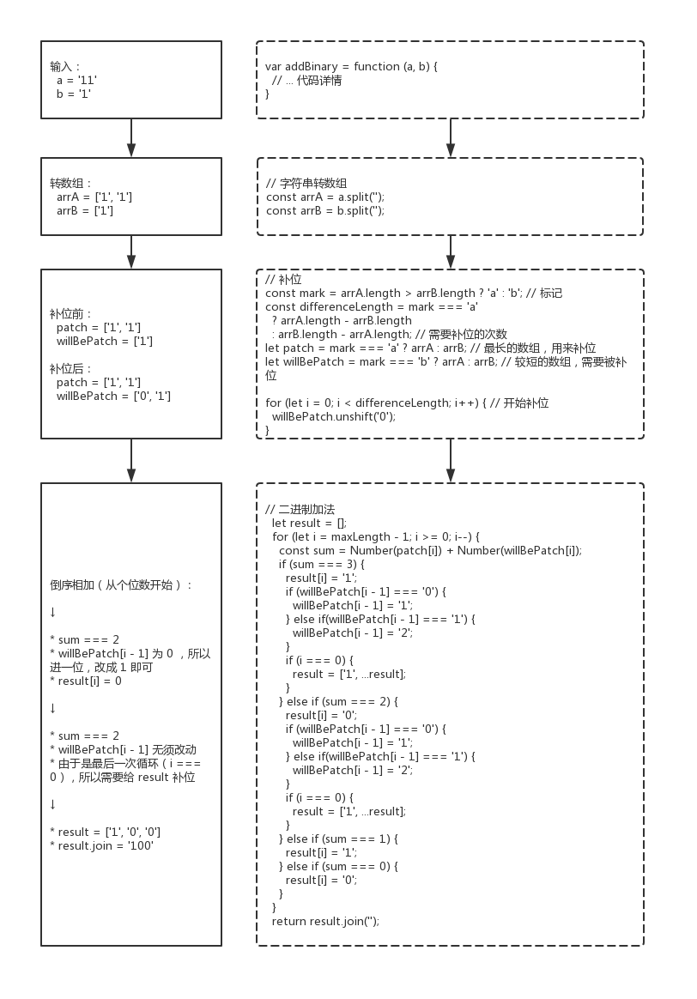
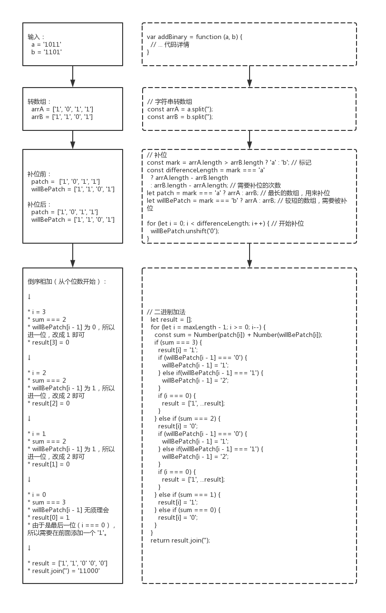

067 - 二进制求和（add-binary）
===

> Create by **jsliang** on **2019-06-11 10:07:17**  
> Recently revised in **2019-09-18 10:20:02**

## <a name="chapter-one" id="chapter-one">一 目录</a>

**不折腾的前端，和咸鱼有什么区别**

| 目录 |
| --- | 
| [一 目录](#chapter-one) | 
| [二 前言](#chapter-two) |
| [三 解题](#chapter-three) |
| &emsp;[3.1 解题 - 转数组](#chapter-three-one) |
| &emsp;[3.2 解题 - 数学算法](#chapter-three-two) |

## <a name="chapter-two" id="chapter-two">二 前言</a>


* **难度**：简单
* **涉及知识**：数字、字符串
* **题目地址**：https://leetcode-cn.com/problems/add-binary/
* **题目内容**：

```
给定两个二进制字符串，返回他们的和（用二进制表示）。

输入为非空字符串且只包含数字 1 和 0。

示例 1:
输入: a = "11", b = "1"
输出: "100"

示例 2:
输入: a = "1010", b = "1011"
输出: "10101"
```

## <a name="chapter-three" id="chapter-three">三 解题</a>


小伙伴可以先自己在本地尝试解题，再回来看看 **jsliang** 讲解下使用 JavaScript 的解题思路。

### <a name="chapter-three-one" id="chapter-three-one">3.1 解法 - 转数组</a>


* **解题代码**：

```js
var addBinary = function (a, b) {
  // 字符串转数组
  const arrA = a.split('');
  const arrB = b.split('');
  
  // 补位
  const mark = arrA.length > arrB.length ? 'a' : 'b'; // 标记
  const differenceLength = mark === 'a' ? arrA.length - arrB.length : arrB.length - arrA.length; // 需要补位的次数
  let patch = mark === 'a' ? arrA : arrB; // 最长的数组，用来补位
  let willBePatch = mark === 'b' ? arrA : arrB; // 较短的数组，需要被补位
  for (let i = 0; i < differenceLength; i++) { // 开始补位
    willBePatch.unshift('0');
  }

  // 二进制加法
  const maxLength = mark === 'a' ? arrA.length : arrB.length; // 最长数组的长度
  let result = [];
  for (let i = maxLength - 1; i >= 0; i--) {
    const sum = Number(patch[i]) + Number(willBePatch[i]);
    if (sum === 3) {
      result[i] = '1';
      if (willBePatch[i - 1] === '0') {
        willBePatch[i - 1] = '1';
      } else if(willBePatch[i - 1] === '1') {
        willBePatch[i - 1] = '2';
      }
      if (i === 0) {
        result = ['1', ...result];
      }
    } else if (sum === 2) {
      result[i] = '0';
      if (willBePatch[i - 1] === '0') {
        willBePatch[i - 1] = '1';
      } else if(willBePatch[i - 1] === '1') {
        willBePatch[i - 1] = '2';
      }
      if (i === 0) {
        result = ['1', ...result];
      }
    } else if (sum === 1) {
      result[i] = '1';
    } else if (sum === 0) {
      result[i] = '0';
    }
  }
  return result.join('');
};
```

* **执行测试**：

1. `a`：`['1', '1', '1'`
2. `b`：`['1']`
3. `return`：

```js
1000
```

* **LeetCode Submit**：

```js
✔ Accepted
  ✔ 294/294 cases passed (96 ms)
  ✔ Your runtime beats 89.55 % of javascript submissions
  ✔ Your memory usage beats 15.19 % of javascript submissions (36.4 MB)
```

* **知识点**：

1. `split()`：`split()` 方法使用指定的分隔符字符串将一个 String 对象分割成字符串数组，以将字符串分隔为子字符串，以确定每个拆分的位置。[`split()` 详细介绍](https://github.com/LiangJunrong/document-library/blob/master/JavaScript-library/JavaScript/%E5%86%85%E7%BD%AE%E5%AF%B9%E8%B1%A1/String/split.md)
2. `unshift()`：`unshift()` 方法将一个或多个元素添加到数组的开头，并返回该数组的新长度。[`unshift()` 详细介绍](https://github.com/LiangJunrong/document-library/blob/master/JavaScript-library/JavaScript/%E5%86%85%E7%BD%AE%E5%AF%B9%E8%B1%A1/Array/unshift.md)
3. `join()`：`join()` 方法将一个数组（或一个类数组对象）的所有元素连接成一个字符串并返回这个字符串。[`join()` 详细介绍](https://github.com/LiangJunrong/document-library/blob/master/JavaScript-library/JavaScript/%E5%86%85%E7%BD%AE%E5%AF%B9%E8%B1%A1/Array/join.md)

* **解题思路**：

**首先**，看到本次解题，小伙伴们应该被震惊到了。

的确，**jsliang** 一开始本来打算按照正常思路写的，后面写着写着，提交成功后，发现它居然有那么多代码，也是愣了！

不过不要紧，**jsliang** 感觉自己的思路应该按照了正常人的思路，所以会尝试给小伙伴们讲解下这个解法的思路，如果小伙伴们听不懂不要紧，可以看下面的解法。（推荐还是看下正常思路，有利于思维的提升）

**然后**，我们分两组情况进行讲解：

* **第一组**：`(a, b) => ('11', '1')`



* **第二组**：`(a, b) => ('1011', '1101')`



**最后**，经过分析，小伙伴们是不是觉得这思路非常正常了，然后能不能自己脑补下 `(a, b) => ('1111', '1111')` 的过程，哈哈~

### <a name="chapter-three-two" id="chapter-three-two">3.2 解法 - 数学算法</a>


* **解题代码**：

```js
var addBinary = function (a, b) {
  let carry = 0; // 进位标记
  let res = [];
  aindex = a.length - 1;
  bindex = b.length - 1;
  while (aIndex >= 0 || bIndex >= 0) { // a 或 b 还有位可以相加
    sum = (+a[aIndex] || 0) + (+b[bIndex] || 0) + carry; // aIndex bIndex可能为负数值，需要转化为 0
    carry = sum >= 2 ? 1 : 0;
    res.push(sum % 2);
    aIndex--;
    bIndex--;
  }
  if (carry) {
    res.push(1);
  }
  return res.reverse().join('');
};
```

* **执行测试**：

1. `a`：`['1', '1', '1'`
2. `b`：`['1']`
3. `return`：

```js
1000
```

* **LeetCode Submit**：

```js
✔ Accepted
  ✔ 294/294 cases passed (100 ms)
  ✔ Your runtime beats 87.05 % of javascript submissions
  ✔ Your memory usage beats 83.12 % of javascript submissions (35.3 MB)
```

* **知识点**：

1. `push()`：`push()` 方法将一个或多个元素添加到数组的末尾，并返回该数组的新长度。[`push()` 详细介绍](https://github.com/LiangJunrong/document-library/blob/master/JavaScript-library/JavaScript/%E5%86%85%E7%BD%AE%E5%AF%B9%E8%B1%A1/Array/push.md)
2. `reverse()`：`reverse()` 方法将数组中元素的位置颠倒,并返回该数组。该方法会改变原数组。[`reverse()` 详细介绍](https://github.com/LiangJunrong/document-library/blob/master/JavaScript-library/JavaScript/%E5%86%85%E7%BD%AE%E5%AF%B9%E8%B1%A1/Array/reverse.md)
3. `join()`：`join()` 方法将一个数组（或一个类数组对象）的所有元素连接成一个字符串并返回这个字符串。[`join()` 详细介绍](https://github.com/LiangJunrong/document-library/blob/master/JavaScript-library/JavaScript/%E5%86%85%E7%BD%AE%E5%AF%B9%E8%B1%A1/Array/join.md)

* **解题思路**：

**首先**，毋庸置疑，这个方法比 **jsliang** 写的方法好多了。

**然后**，通过进位标志 `carry` 和结果值 `res`，它将每一步的值都存储起来。

**接着**，当循环遍历完毕，但是 `carry` 还有值（不为 `0`）的时候，就给数组首位添加 `1`。

**最后**，因为数组遍历是顺序，所以需要通过 `reverse()` 将数组反转，再通过 `split()` 转成字符串即可。

---

**不折腾的前端，和咸鱼有什么区别！**


**jsliang** 会每天更新一道 LeetCode 题解，从而帮助小伙伴们夯实原生 JS 基础，了解与学习算法与数据结构。

扫描上方二维码，关注 **jsliang** 的公众号，让我们一起折腾！

