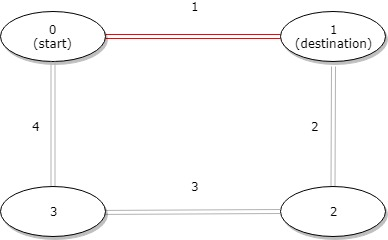
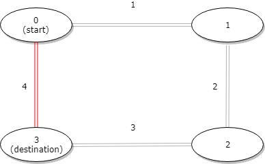

1184 - 公交站间的距离（distance-between-bus-stops）
===

> Create by **jsliang** on **2020-01-31 18:57:58**  
> Recently revised in **2020-01-31 19:35:37**

## 一 目录

**不折腾的前端，和咸鱼有什么区别**

| 目录 |
| --- | 
| [一 目录](#chapter-one) | 
| [二 前言](#chapter-two) |
| [三 解题及测试](#chapter-three) |
| [四 LeetCode Submit](#chapter-four) |
| [五 解题思路](#chapter-five) |

## 二 前言


* **难度**：简单
* **涉及知识**：数组
* **题目地址**：https://leetcode-cn.com/problems/distance-between-bus-stops/
* **题目内容**：

环形公交路线上有 n 个站，按次序从 0 到 n - 1 进行编号。

我们已知每一对相邻公交站之间的距离，distance[i] 表示编号为 i 的车站和编号为 (i + 1) % n 的车站之间的距离。

环线上的公交车都可以按顺时针和逆时针的方向行驶。

返回乘客从出发点 start 到目的地 destination 之间的最短距离。

---

示例 1：



* 输入：distance = [1,2,3,4], start = 0, destination = 1
* 输出：1
* 解释：公交站 0 和 1 之间的距离是 1 或 9，最小值是 1。

---

示例 2：


* 输入：distance = [1,2,3,4], start = 0, destination = 2
* 输出：3
* 解释：公交站 0 和 2 之间的距离是 3 或 7，最小值是 3。
 
---

示例 3：



* 输入：distance = [1,2,3,4], start = 0, destination = 3
* 输出：4
* 解释：公交站 0 和 3 之间的距离是 6 或 4，最小值是 4。

提示：

1. 1 <= n <= 10^4
2. distance.length == n
3. 0 <= start, destination < n
4. 0 <= distance[i] <= 10^4

* 来源：力扣（LeetCode）
* 链接：https://leetcode-cn.com/problems/distance-between-bus-stops
* 著作权归领扣网络所有。商业转载请联系官方授权，非商业转载请注明出处。

## 三 解题及测试


小伙伴可以先自己在本地尝试解题，再回来看看 **jsliang** 的解题思路。

* **LeetCode 给定函数体**：

```js
/**
 * @param {number[]} distance
 * @param {number} start
 * @param {number} destination
 * @return {number}
 */
var distanceBetweenBusStops = function(distance, start, destination) {
    
};
```

根据上面的已知函数，尝试破解本题吧~

确定了自己的答案再看下面代码哈~

> index.js

```js
/**
 * @name 公交站间的距离
 * @param {number[]} distance
 * @param {number} start
 * @param {number} destination
 * @return {number}
 */
const distanceBetweenBusStops = (distance, start, destination) => {
  const newStart = Math.min(start, destination);
  const newDestination = Math.max(start, destination);
  let dis = 0;
  let order = 0;
  for (let i = 0; i < distance.length; i++) {
    dis += distance[i];
    if (i >= newStart && i < newDestination) {
      order += distance[i];
    }
  }
  return Math.min(order, dis - order);
};

console.log(distanceBetweenBusStops([1, 2, 3, 4], 0, 1)); // 1
console.log(distanceBetweenBusStops([1, 2, 3, 4], 0, 2)); // 3
console.log(distanceBetweenBusStops([1, 2, 3, 4], 0, 3)); // 4
console.log(distanceBetweenBusStops([7, 10, 1, 12, 11, 14, 5, 0], 7, 2)); // 17
```

`node index.js` 返回：

```js
1
3
4
17
```

## 四 LeetCode Submit


```js
Accepted
* 37/37 cases passed (68 ms)
* Your runtime beats 47.71 % of javascript submissions
* Your memory usage beats 19.15 % of javascript submissions (34.7 MB)
```

## 五 解题思路


不要被题意迷惑，咱们不管是顺着走还是逆着走最近，地球是圆的，咱们先把顺着走的计算出来：

> 暴力破解

```js
const distanceBetweenBusStops = (distance, start, destination) => {
  const newStart = Math.min(start, destination);
  const newDestination = Math.max(start, destination);
  let dis = 0;
  let order = 0;
  for (let i = 0; i < distance.length; i++) {
    dis += distance[i];
    if (i >= newStart && i < newDestination) {
      order += distance[i];
    }
  }
  return Math.min(order, dis - order);
};
```

第一步先对齐 `start` 和 `destination`，变成 `newStart` 和 `newDestination`，让他两顺着排序。

第二步设置总长度 `dis`。

第三步设置顺着走长度 `order`。

题目的意思是给个数组 `distance = [1, 2, 3, 4]`，然后：

1. 第 0 个元素就是：0 -> 1 的距离。
2. 第二个元素是 `1 -> 2` 的距离。
3. ……所以咱们需要求 `newStart` 到 `newDestination` 的距离，那么就是 `[newStart, newDestination)` 的距离啦，注意开闭区间。

第四步就直接返回 `order` 和 `dis - order` 的最小值即可~

Submit 提交：

```js
Accepted
* 37/37 cases passed (68 ms)
* Your runtime beats 47.71 % of javascript submissions
* Your memory usage beats 19.15 % of javascript submissions (34.7 MB)
```

当然，如果小伙伴们有更好的思路想法，欢迎评论留言或者私聊 **jsliang**~

---

**不折腾的前端，和咸鱼有什么区别！**


**jsliang** 会每天更新一道 LeetCode 题解，从而帮助小伙伴们夯实原生 JS 基础，了解与学习算法与数据结构。

**浪子神剑** 会每天更新面试题，以面试题为驱动来带动大家学习，坚持每天学习与思考，每天进步一点！

扫描上方二维码，关注 **jsliang** 的公众号（左）和 **浪子神剑** 的公众号（右），让我们一起折腾！

