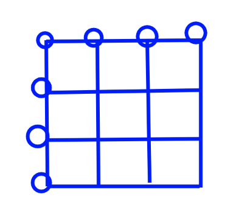

766 - 托普利兹矩阵（toeplitz-matrix）
===

> Create by **jsliang** on **2020-01-03 08:56:17**  
> Recently revised in **2020-01-03 10:38:06**

## 一 目录

**不折腾的前端，和咸鱼有什么区别**

| 目录 |
| --- | 
| [一 目录](#chapter-one) | 
| [二 前言](#chapter-two) |
| [三 解题及测试](#chapter-three) |
| [四 LeetCode Submit](#chapter-four) |
| [五 解题思路](#chapter-five) |

## 二 前言


* **难度**：简单
* **涉及知识**：数组
* **题目地址**：https://leetcode-cn.com/problems/toeplitz-matrix/
* **题目内容**：

```
如果一个矩阵的每一方向由左上到右下的对角线上具有相同元素，
那么这个矩阵是托普利茨矩阵。

给定一个 M x N 的矩阵，
当且仅当它是托普利茨矩阵时返回 True。

示例 1:

输入: 
matrix = [
  [1,2,3,4],
  [5,1,2,3],
  [9,5,1,2]
]
输出: True
解释:
在上述矩阵中, 其对角线为:
"[9]", 
"[5, 5]",
"[1, 1, 1]", 
"[2, 2, 2]", 
"[3, 3]",
"[4]"。
各条对角线上的所有元素均相同, 因此答案是True。

示例 2:

输入:
matrix = [
  [1,2],
  [2,2]
]
输出: False
解释: 
对角线"[1, 2]"上的元素不同。

说明:

matrix 是一个包含整数的二维数组。
matrix 的行数和列数均在 [1, 20]范围内。
matrix[i][j] 包含的整数在 [0, 99]范围内。

进阶:

如果矩阵存储在磁盘上，
并且磁盘内存是有限的，
因此一次最多只能将一行矩阵加载到内存中，该怎么办？
如果矩阵太大以至于只能一次将部分行加载到内存中，该怎么办？
```

## 三 解题及测试


小伙伴可以先自己在本地尝试解题，再回来看看 **jsliang** 的解题思路。

* **LeetCode 给定函数体**：

```js
/**
 * @param {number[][]} matrix
 * @return {boolean}
 */
var isToeplitzMatrix = function(matrix) {
    
};
```

根据上面的已知函数，尝试破解本题吧~

确定了自己的答案再看下面代码哈~

> index.js

```js
/**
 * @name 判断斜线
 * @param {number} x x 坐标
 * @param {number} y y 坐标
 * @param {number[][]} matrix 矩阵
 * @param {number} init 需要比对的数值
 */
const judge = (x, y, matrix, init) => {
  if (
    matrix[x] &&
    matrix[x][y] &&
    matrix[x][y] !== init
  ) {
    return false;
  } else if (
    matrix[x] &&
    matrix[x][y] &&
    matrix[x][y] === init
  ) {
    return judge(x + 1, y + 1, matrix, init);
  } else {
    return true;
  }
}

/**
 * @name 托普利茨矩阵
 * @param {number[][]} matrix 矩阵
 * @return {boolean} true/false
 */
const isToeplitzMatrix = (matrix) => {
  for (let i = 0; i < matrix.length; i++) {
    for (let j = 0; j < matrix[0].length; j++) {
      if (matrix[i][j] === 0) {
        matrix[i][j] = 100;
      }
    }
  }
  // 计算第一横排
  for (let i = 0; i < matrix.length; i++) {
    if (!judge(i, 0, matrix, matrix[i][0])) {
      return false;
    }
  }
  // 计算第一横排 - 排除 [0, 0] 坐标
  for (let i = 1; i < matrix[0].length; i++) {
    if (!judge(0, i, matrix, matrix[0][i])) {
      return false;
    }
  }
  return true;
};

console.log(isToeplitzMatrix([
  [1, 2, 3, 4],
  [5, 1, 2, 3],
  [9, 5, 1, 2],
])); // true
console.log(isToeplitzMatrix([
  [1, 2],
  [2, 2],
])); // fasle
console.log(isToeplitzMatrix([
  [0, 33, 98],
  [34, 22, 33],
])); // false
```

`node index.js` 返回：

```js
true
false
false
```

## 四 LeetCode Submit


```js
Accepted
* 482/482 cases passed (72 ms)
* Your runtime beats 87.62 % of javascript submissions
* Your memory usage beats 19.23 % of javascript submissions (36.5 MB)
```

## 五 解题思路


**首先**，观察题目，了解实情：

1. 斜角线必须一致
2. 对应的要知道的开头是第一横排和第一竖排



> 没找到合适的画图软件，网上找了个

如上图。

**然后**，通过这些位置，定点斜线即可：

> 暴力破解

```js
/**
 * @name 判断斜线
 * @param {number} x x 坐标
 * @param {number} y y 坐标
 * @param {number[][]} matrix 矩阵
 * @param {number} init 需要比对的数值
 */
const judge = (x, y, matrix, init) => {
  if (
    matrix[x] &&
    matrix[x][y] &&
    matrix[x][y] !== init
  ) {
    return false;
  } else if (
    matrix[x] &&
    matrix[x][y] &&
    matrix[x][y] === init
  ) {
    return judge(x + 1, y + 1, matrix, init);
  } else {
    return true;
  }
}

/**
 * @name 托普利茨矩阵
 * @param {number[][]} matrix 矩阵
 * @return {boolean} true/false
 */
const isToeplitzMatrix = (matrix) => {
  for (let i = 0; i < matrix.length; i++) {
    for (let j = 0; j < matrix[0].length; j++) {
      if (matrix[i][j] === 0) {
        matrix[i][j] = 100;
      }
    }
  }
  // 计算第一横排
  for (let i = 0; i < matrix.length; i++) {
    if (!judge(i, 0, matrix, matrix[i][0])) {
      return false;
    }
  }
  // 计算第一横排 - 排除 [0, 0] 坐标
  for (let i = 1; i < matrix[0].length; i++) {
    if (!judge(0, i, matrix, matrix[0][i])) {
      return false;
    }
  }
  return true;
};
```

因为会出现元素为 0 的情况，所以为了避免 0 的堵塞，我直接将数组中的 0 给改成了 100。

因此，如果你对这道题有优化想法，可以从这个方面入手。

> 因为要开工了，所以今天优化不了

如果小伙伴有更好的思路想法，欢迎评论留言或者私聊~

---

**不折腾的前端，和咸鱼有什么区别！**


**jsliang** 会每天更新一道 LeetCode 题解，从而帮助小伙伴们夯实原生 JS 基础，了解与学习算法与数据结构。

**浪子神剑** 会每天更新面试题，以面试题为驱动来带动大家学习，坚持每天学习与思考，每天进步一点！

扫描上方二维码，关注 **jsliang** 的公众号（左）和 **浪子神剑** 的公众号（右），让我们一起折腾！

