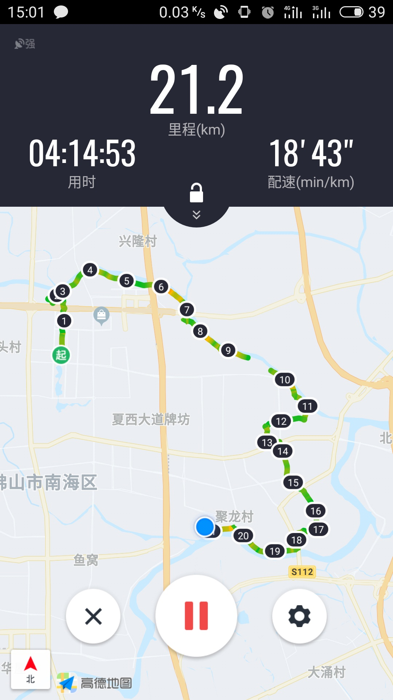

朝花夕拾 - 徒步
===

> Create by **jsliang** on **2019-3-31 20:25:20**  
> Recently revised in **2019-09-19 09:42:52**

* **时间**：【2019-03-31】
* **地点**：【佛山】

* 经过为期 4 个半多小时的长途跋涉走完 21.2 公里的时候，我已经精疲力尽了，所以和建光师弟跑去【佛山祖庙】溜达

* 最后在当晚 19:00 - 20:00 多，我和建光师弟跑去终点处，和完成竞赛的非常疲惫的两位老哥进行合影

---

> **jsliang** 广告推送：  
> 也许小伙伴想了解下云服务器  
> 或者小伙伴想买一台云服务器  
> 或者小伙伴需要续费云服务器  
> 欢迎点击 **[云服务器推广](https://github.com/LiangJunrong/document-library/blob/master/other-library/Monologue/%E7%A8%B3%E9%A3%9F%E8%89%B0%E9%9A%BE.md)** 查看！

