朝花夕拾 - 1024 - LeetCode
===

> Create by **jsliang** on **2020-10-24 16:19:53**  
> Recently revised in **2020-10-24 18:14:36**

<!-- 目录开始 -->
## 目录

**不折腾的前端，和咸鱼有什么区别**

| 目录 |
| --- |
| [前言](#chapter-two) |
| [故事线](#chapter-three) |
| [故事开始](#chapter-four) |
| [结局 A](#chapter-five) |
| [结局 B](#chapter-six) |
| [结局 C](#chapter-seven) |
| [结局 D](#chapter-eight) |
| [结局 E](#chapter-night) |
| [少侠，接招！](#chapter-ten) |
<!-- 目录结束 -->

## 前言


作为一枚每天坚持刷 LeetCode 的游戏爱好者，今天发现 LeetCode 搞了个活动，所以将它的全攻略打出来了！

这个活动有 5 个好结局，其他都是 Bad End，Bad End 需要做 LeetCode 的第 1024 题才能解脱。

最后 **jsliang** 根据这些结局，出了一道题，感兴趣的小伙伴可以尝试挑战~

## 故事线


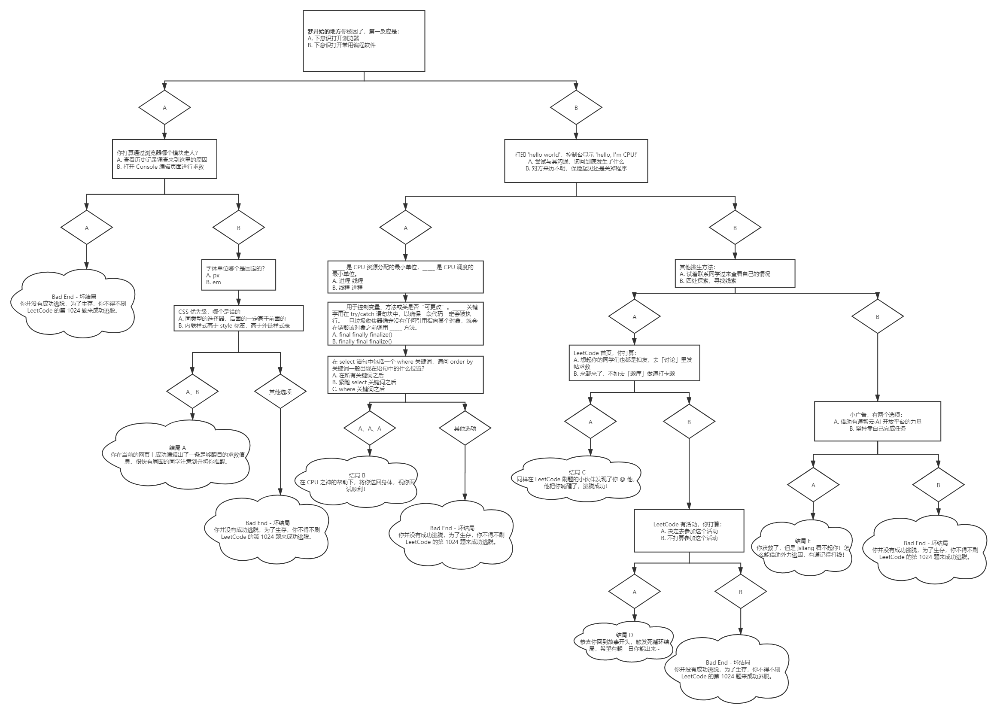

## 故事开始


## 结局 A


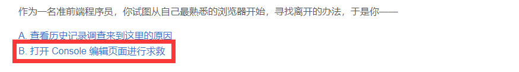
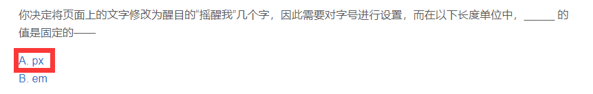
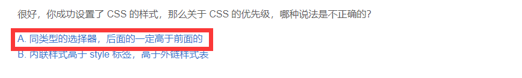


## 结局 B


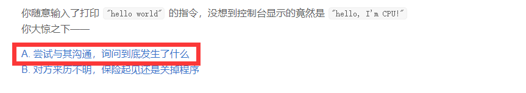
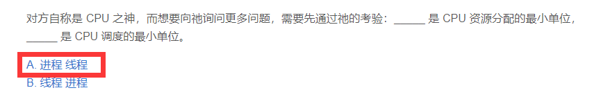
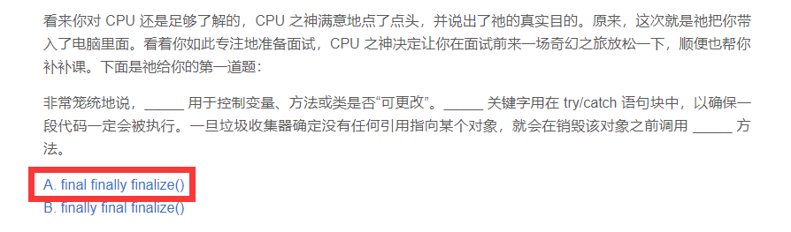
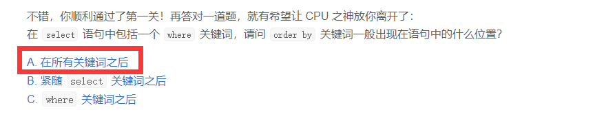


## 结局 C


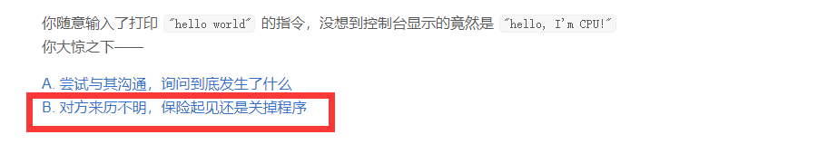
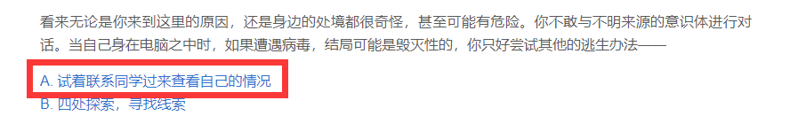
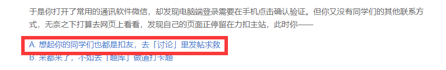


## 结局 D


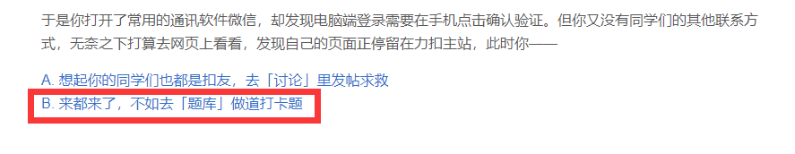
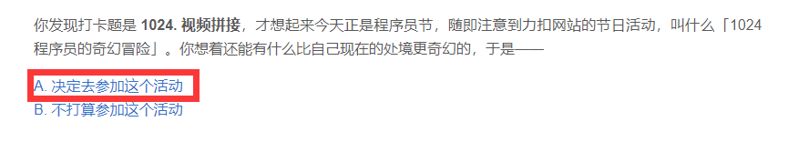


注：该结局是死循环~

## 结局 E


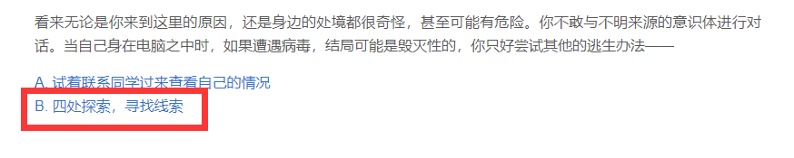
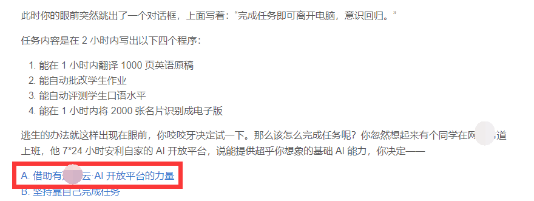


## 少侠，接招！


**jsliang** 给你 `new` 了一个对象：

```js
const obj = {};

obj['A'] = {
  'A': 'Bad End',
  'B': {
    'A': {
      'A': 'Bad End',
      'B': 'End A'
    },
    'B': 'Bad End',
  },
};

obj['B'] = {
  'A': {
    'A': {
      'A': {
        'A': 'End B',
        'B': 'Bad End',
      },
      'B': 'Bad End',
    },
    'B': 'Bad End',
  },
  'B': {
    'A': {
      'A': 'End C',
      'B': {
        'A': obj,
        'B': 'Bad End',
      },
    },
    'B': {
      'A': 'End E',
      'B': 'Bad End',
    },
  },
};
```

请输出所有成功逃生的通道（`Good End`）：

```js
/**
 * @name 获取所有通关路线图
 * @param {object} obj 路线图
 * @return {array} 返回所有成功的路线图，例如 ['A-B-A-B', ...]
 */
const getGoodEnd = (obj) => {

};
```

---

* 答案

这里要点有 2 点：

1. 防止递归调用的时候，在某个位置的死循环
2. 通过回溯解决问题

```js
/**
 * @name 获取所有通关路线图
 * @param {object} obj 路线图
 * @return {array} 返回所有成功的路线图，例如 ['A-B-A-B', ...]
 */
const getGoodEnd = (obj) => {

  // 1. 设置哈希集合
  const set = new Set();

  // 2. 精准判断类型
  const getType = (param) => Object.prototype.toString.call(param).slice(8, -1);

  // 3. 设置返回结果
  const result = [];

  // 4. 递归路线图
  const recursion = (obj, path = []) => {

    // 4.1 遍历当前路线图
    for (let i in obj) {

      // 4.2 如果是自身属性并且没有走过这条路
      if (obj.hasOwnProperty(i) && !set.has(obj[i])) {

        // 4.3 【回溯】先填充路线
        path.push(i);

        // 4.4 判断目标是对象，那就进一步递归
        if (getType(obj[i]) === 'Object') {

          // 4.4.1 设置这条路线走过了
          set.add(obj[i]);

          // 4.4.2 进一步递归它
          recursion(obj[i], path);

        } else if (getType(obj[i] === 'String') && obj[i].includes('End ')) {

          // 4.5 如果走到底了，并且字符串是 End X 的形式，那就是好结局
          result.push(path.join('-'));
        }

        // 4.6 【回溯】推出刚才走过的路线，方便走下一条通道
        path.pop();
      }
    }
  };
  recursion(obj, []);

  // 5. 返回结果
  return result;
};
```

---

**不折腾的前端，和咸鱼有什么区别！**

觉得文章不错的小伙伴欢迎点赞/点 Star。

如果小伙伴需要联系 **jsliang**：

* [Github](https://github.com/LiangJunrong/document-library)
* [掘金](https://juejin.im/user/3403743728515246)

联系方式存放在 Github 首页，坚持每天一道 LeetCode，坚持每天学习，欢迎一起折腾~


