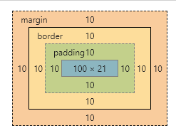

盒子模型
===

> Create by **jsliang** on **2020-09-25 10:04:37**  
> Recently revised in **2020-12-12 15:41:57**

<!-- 目录开始 -->
## 一 目录

**不折腾的前端，和咸鱼有什么区别**

| 目录 |
| --- |
| [一 目录](#chapter-one) |
| [二 前言](#chapter-two) |
| [三 举例](#chapter-three) |
| [四 题目](#chapter-four) |
| &emsp;[4.1 题目 1：简单描述下盒子模型](#chapter-four-one) |
| &emsp;[4.2 题目 2：计算实际 margin 和 padding](#chapter-four-two) |
<!-- 目录结束 -->

## 二 前言


CSS 盒子模型分为标准盒子和怪异盒子。

那么标准盒子和怪异盒子的 `width`、`padding`、`border` 以及 `margin` 是如何相处的呢？

如何设置一个块为标准盒子或者怪异盒子呢？

下面我们一一讲解。

## 三 举例


已知有代码：

```html
<!DOCTYPE html>
<html lang="en">
<head>
  <meta charset="UTF-8">
  <meta name="viewport" content="width=device-width">
  <meta http-equiv="X-UA-Compatible" content="ie=edge">
  <title>盒子模型</title>
  <style>
    div {
      background: deepskyblue;

      /* 怪异盒子：100 */
      /* box-sizing: border-box;  */

      /* 标准盒子：140 */
      box-sizing: content-box;

      width: 100px;
      padding: 10px;
      border: 10px solid #ccc;
      margin: 10px;
    }
  </style>
</head>
<body>
  <div>盒子模型</div>
</body>
</html>
```

此刻它在 W3C 标准（标准盒子）下展示为：



在 IE（怪异盒子）下展示为：


假设我们编写 JS 脚本如下：

```js
const div = document.querySelector('div');

// 如果写在行内，可以获取 100px，当前打印为空
// （标准盒子和怪异盒子相同，注意带单位的）
console.log(div.style.width); // 100px || ''

// 标准盒子：140；怪异盒子：100;（不带单位的）
console.log(div.offsetWidth); // 100 || 140
```

关于 JavaScript 获取 HTML 元素的实际宽度高度：

1. `#div.style.width`：这种方法只有在样式写在行内的时候，才能获取到宽度，并且是带单位的：`100px`。如果不是行内样式，那么获取到的是空的。
2. `#div.offsetWidth`：这种方法看盒子模式，如果是 IE 模式的怪异盒子，那么获取到 `100`（`border-box`）；如果是 W3C 的标准盒子（`content-box`），那么获取到 `140`。注意是不带单位的。

## 四 题目


小收集几道题。

### 4.1 题目 1：简单描述下盒子模型


请简单描述下盒子模型？

---

> 考查内容：盒子模型

答：

1. CSS 盒子模型分为标准盒子和怪异盒子。
2. 标准盒子的 `contentWidth` 等于设置的 `width`，它的`实际总宽度 = width + padding + border + margin`。（高度也一样）
3. 怪异盒子的 `contentWidth` 等于设置的 `width + padding + border`，它的`实际总宽度 = contentWidth + margin`。（高度也一样）
4. 建议在页面初始化的时候，设置全局 CSS 属性 `box-sizing`，统一标准。
   * `inherit` - 继承父元素的值
   * `content-box` - 指定盒子为 W3C（标准盒子）
   * `border-box` - 指定为 IE（怪异盒子）。

### 4.2 题目 2：计算实际 margin 和 padding


怪异盒子（`border-box`）下宽度为 `100px`，高度为 `200px`，设置它的 `padding` 和 `margin` 为 `20%`，请问它的 `padding` 和 `margin` 实际为多少？

```html
<style>
  div {
    box-sizing: border-box;

    width: 100px;
    height: 200px;
    padding: 20%;
    border: 10px solid #ccc;
    margin: 20%;
  }
</style>

<body>
  <div>怪异盒子</div>
</body>
```

---

> 考查内容：盒子模型 + CSS 百分比

答：

开放式题目，有坑，百分比设置是相对于上一个块元素来说的。

假设 `body` 下有一个 `div`，那么这个 `div` 设置百分占比就是找它上一个 `display: block/inline-block` 元素，即 `body` 的宽度（默认 `100%`）。

所以这时候需要得知 `body` 在浏览器中显示的实际宽度，才可以计算出 `div` 的 `padding` 和 `margin`。

所以这道题跟盒子模型无关的！

既然这样，我们改下题目，假设：

```html
<style>
.div {
  background: deepskyblue;

  /* 怪异盒子*/
  box-sizing: border-box;

  /* 标准盒子 */
  /* box-sizing: content-box; */

  width: 100px;
  height: 200px;
  padding: 20%;
  border: 10px solid #ccc;
  margin: 20%;
}
</style>

<div style="display: inline-block">
 <div class="div">
   盒子模型
 </div>
</div>
```

请问怪异盒子和标准盒子下它的 `padding` 和 `margin` 是多少？

* 怪异盒子

1. 此时父元素（第一个盒子）没有宽度，会被它的子元素撑宽，所以父元素的宽度是 `100px`。（这个宽度就跟怪异盒子有关，`100px` 是 `.div` 盒子的宽度）
2. 父元素的 `20%` = `100 * 20%` = `20px`。
3. 所以此时它的 `padding` 和 `margin` 是 `20px`。

* 标准盒子

1. 此时父元素被子元素撑宽，父元素的宽度是 `120px`（标准盒子下，`120px` 是 `.div` 盒子的 `width` + 两个 `border`）
2. 父元素的 `20%` = `120 * 20%` = `24px`。
3. 所以此时它的 `padding` 和 `margin` 是 `24px`。

那么高度呢？请计算一下！

---


